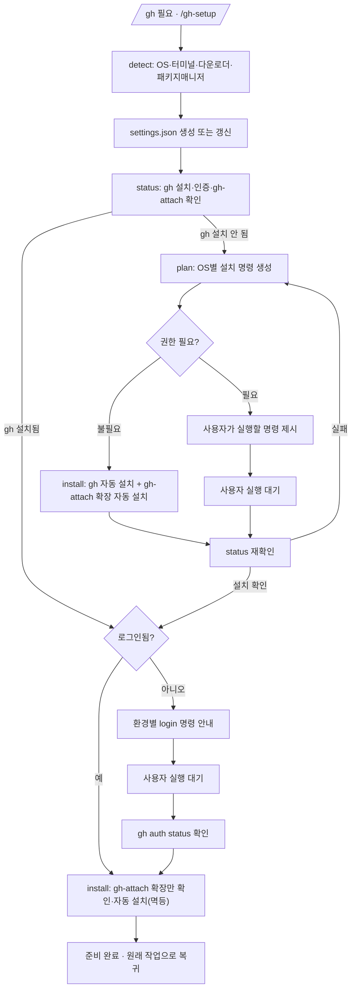

<skill>
  <purpose>
    `gh` 를 쓰는 모든 흐름의 진입 장벽을 없앤다.
    OS·터미널·다운로드 도구·패키지 매니저를 감지해 설정 파일에 남기고,
    그 조합에 맞는 설치 명령을 만들어 자동 실행하거나 정확히 안내한다.
    로그인을 확인한 뒤, private 저장소 증거 이미지 업로드에 쓰는 `gh-attach` 확장까지 자동 설치한다.
  </purpose>

  <inputs>
    <arg name="$ARGUMENTS" required="false">`install` / `login` / `status` 같은 원하는 단계. 생략하면 전체 흐름</arg>
  </inputs>

  <preconditions>
    <item>없음. 이 스킬이 전제를 만드는 쪽이다</item>
  </preconditions>

  <routing>
    <always>references/settings.md — settings.json 스키마와 선호도 편집</always>
    <branch name="install" when="gh 가 설치되어 있지 않음">references/install-matrix.md</branch>
    <branch name="login" when="gh 는 있는데 인증이 안 됨">references/auth-login.md</branch>
  </routing>

  <hard-rules>
    <rule>sudo 나 관리자 권한이 필요한 명령을 대신 실행하지 않는다. 비밀번호 프롬프트에서 멈춘다.</rule>
    <rule>권한이 필요 없는 패키지 매니저 설치만 자동 실행한다. `gh extension install sudosubin/gh-attach` 도 sudo 가 필요 없으므로 gh 설치·인증 확인 뒤 자동 실행 대상이다.</rule>
    <rule>`gh auth login` 은 대화형이므로 사용자가 직접 실행하게 한다.</rule>
    <rule>토큰 값을 출력하거나 파일로 저장하지 않는다. gh-attach 의 세션 쿠키·`GH_ATTACH_SESSION_TOKEN` 도 마찬가지로 다루지 않는다 — 이 스킬은 확장 설치까지만 하고 쿠키를 직접 만지지 않는다.</rule>
    <rule>사용자가 설정 파일에 넣어 둔 선호 순서를 재감지로 덮어쓰지 않는다.</rule>
  </hard-rules>

  <handoff>
    `gh` 준비가 끝나면 원래 하려던 작업(`issue-create` / `issue-start` / `issue-end` 등)으로 돌아간다.
  </handoff>
</skill>

# 전체 흐름



# 스크립트 경로

아래 중 **존재하는 첫 번째 경로**를 `<skill>` 로 쓴다.

```text
.claude/skills/gh-setup      # 현재 프로젝트 (Claude Code)
.codex/skills/gh-setup       # 현재 프로젝트 (Codex)
~/.claude/skills/gh-setup    # 홈 설치
~/.codex/skills/gh-setup     # 홈 설치
```

# 런타임 라우팅

항상 **라우터**를 부른다. 라우터가 node → python 순으로 찾아 넘기고, 둘 다 없으면 자체 폴백으로 처리한다.

```bash
sh <skill>/scripts/gh-env.sh <서브커맨드>            # macOS / Linux / WSL
powershell -ExecutionPolicy Bypass -File <skill>/scripts/gh-env.ps1 <서브커맨드>   # Windows
```

출력의 `RUNTIME=` 으로 어느 구현이 돌았는지 알 수 있다 (`node` / `python` / `sh` / `ps1`).
폴백(`sh` / `ps1`)은 감지와 안내까지만 한다. `install` 자동 실행과 `config set` 은 지원하지 않는다.

# 서브커맨드

```text
detect              감지 후 ~/.issue/settings.json 생성·갱신
status              gh 설치·인증·gh-attach 확장 확인 후 settings.gh 갱신
plan                OS별 설치 명령 목록 ([auto] / [user] / [guide] 표시)
install [--dry-run] [auto] 표시된 명령만 실행. gh 확인 뒤 gh-attach 확장도 자동 설치(멱등)
login               환경에 맞는 로그인 방법 안내
config get [key]    설정 읽기
config set <k> <v>  terminals / downloaders 순서 변경 (쉼표 구분)
```

# 실행 순서

## 1단계 — 감지와 상태 확인

```bash
sh <skill>/scripts/gh-env.sh detect
sh <skill>/scripts/gh-env.sh status
```

`GH_INSTALLED=1` 이고 `GH_AUTHENTICATED=1` 이어도 `GH_ATTACH_INSTALLED=1` 이 아니면 2단계로 간다.
`install` 은 gh 가 이미 있으면 그 부분은 건드리지 않고 gh-attach 확장만 확인·설치하므로 매번 호출해도
안전하다. 셋 다 1이면 여기서 끝이다. 바로 원래 작업으로 돌아간다.

## 2단계 — 설치

```bash
sh <skill>/scripts/gh-env.sh plan
sh <skill>/scripts/gh-env.sh install
```

`install` 은 `[auto]` 단계만 실행한다(gh 자체의 자동 설치 명령 + gh 확인 후 이어지는
`gh extension install sudosubin/gh-attach`). `[user]` 로 남은 명령은 사용자에게 이렇게 전달한다.

```text
아래 명령을 프롬프트에 그대로 붙여 실행해 주세요 (`!` 로 시작하면 이 세션에서 바로 돌아갑니다).

! sudo apt update && sudo apt install gh -y
```

세부 매트릭스는 `references/install-matrix.md`.

## 3단계 — 로그인

```bash
sh <skill>/scripts/gh-env.sh login
```

`LOGIN_REQUIRED=1` 이면 안내된 명령을 사용자가 실행할 때까지 기다린다. 세부는 `references/auth-login.md`.

## 4단계 — 확인과 복귀

```bash
sh <skill>/scripts/gh-env.sh status
```

`GH_INSTALLED=1`, `GH_AUTHENTICATED=1` 을 확인한 뒤 원래 작업을 이어간다. `GH_ATTACH_INSTALLED=0`
이 남아 있어도(로그인 없이도 설치는 되어야 정상이라 드문 경우다) 막지 않는다 — private 저장소
이미지 자동 업로드가 안 될 뿐 `gh` 자체 흐름과는 무관하니 원래 작업으로 돌아가고, 필요해지는
시점(issue-start/issue-end 의 이미지 업로드 단계)에 그 스킬이 알아서 수동 업로드로 폴백한다.

## 마무리 보고

```text
플랫폼     <os> / <arch> (<family>)
터미널     <선호 0번>
gh        <버전> · 로그인 <계정>
gh-attach <설치됨 | 없음>
설정       ~/.issue/settings.json
다음       <원래 하려던 작업>
```
