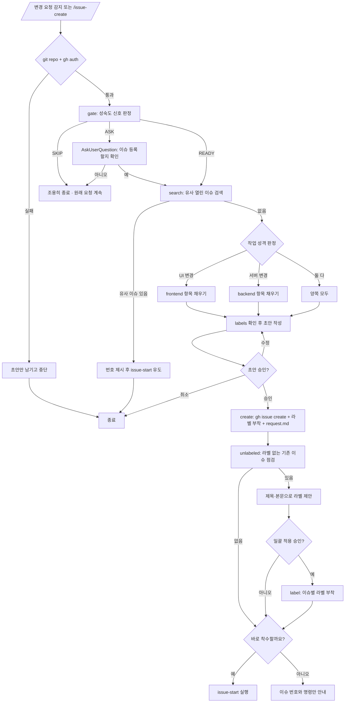

<skill>
  <purpose>
    사용자의 변경 요청이 기본 브랜치에서 바로 시작되지 않게 막고, 먼저 이슈로 등록한다.
    등록할 만한 프로젝트인지 판정하고 중복을 확인한 뒤,
    착수 분석에 바로 쓸 수 있는 이슈를 만들어 번호를 넘긴다.
    이슈 등록이 유일한 목표다. 계획·구현·증거는 전부 `issue-start` 의 몫이다.
  </purpose>

  <inputs>
    <arg name="$ARGUMENTS" required="false">만들 이슈의 내용. 생략하면 직전 대화의 변경 요청을 그대로 쓴다</arg>
  </inputs>

  <preconditions>
    <item>현재 디렉터리가 git 저장소</item>
    <item>`gh auth status` 통과 — 실패하면 `gh-setup` 스킬로 설치·로그인을 먼저 끝낸다</item>
    <item>git, Node 18+</item>
  </preconditions>

  <routing>
    <always>references/maturity-gate.md — 이슈를 만들 단계인지 판정</always>
    <always>references/issue-draft.md — 초안 작성과 라벨 선택</always>
    <always>references/label-audit.md — 라벨 부착과 기존 이슈 라벨 점검</always>
    <always>references/create-and-handoff.md — 등록과 issue-start 인계</always>
  </routing>

  <subagents>
    <agent name="issue-verifier" claude-model="haiku" codex-model="gpt-5.6-luna">
      전제 확인 · 유사 이슈 중복 검사 · 작업 성격 판정
    </agent>
  </subagents>

  <hard-rules>
    <rule>코드를 수정하지 않는다. 이슈 생성까지만 한다.</rule>
    <rule>초안을 보여주고 승인받기 전에는 이슈를 등록하지 않는다.</rule>
    <rule>성숙도 게이트가 SKIP 이면 조용히 빠지고 원래 요청을 방해하지 않는다.</rule>
    <rule>사용자가 `/issue-create` 를 직접 호출하면 게이트를 건너뛴다.</rule>
    <rule>유사한 열린 이슈가 있으면 새로 만들지 않고 그 번호를 제시한다.</rule>
    <rule>만든 이슈에는 라벨을 반드시 하나 이상 붙인다. 스크립트가 `--label` 없는 `create` 를 exit 2 로 막는다.</rule>
    <rule>라벨을 새로 만들거나 기존 이슈의 라벨을 바꾸는 것은 사용자 승인 후에만 한다.</rule>
    <rule>이슈 상태 변경, 코멘트 작성, PR 생성을 하지 않는다.</rule>
  </hard-rules>

  <handoff>
    이슈를 만든 뒤 착수 여부를 묻고, 예면 같은 번호로 `issue-start` 를 이어서 실행한다.
    `.issue/<번호>/request.md` 에 원본 요청을 남겨 `issue-start` 의 대조 분석이 재사용한다.
    `.gitignore` 의 `.issue` 블록은 등록 시 자동으로 들어간다.
    흐름은 `issue-create` → `issue-start` → `issue-end` → `issue-merge`.
  </handoff>
</skill>

# 전체 흐름



# 스크립트 경로

아래 중 **존재하는 첫 번째 경로**를 `<skill>` 로 쓴다. 하나도 없으면 각 레퍼런스의 인라인 절차를 그대로 수행한다.

```text
.claude/skills/issue-create      # 현재 프로젝트 (Claude Code)
.codex/skills/issue-create       # 현재 프로젝트 (Codex)
~/.claude/skills/issue-create    # 홈 설치
~/.codex/skills/issue-create     # 홈 설치
```

`<skill>` 이 `.claude/` 밑이면 실행 계열은 **claude**, `.codex/` 밑이면 **codex** 다. 이 판별로 서브에이전트 모델을 고른다.

# 서브에이전트

전제 확인 · 중복 검사 · 성격 판정은 판정성 작업이라 값싼 모델에 맡긴다.

```text
claude  .claude/agents/issue-verifier.md   (model: haiku)
codex   .codex/agents/issue-verifier.toml  (model = "gpt-5.6-luna")
```

없으면 `migrate-skill-agent.sh --agent issue-verifier --target home --link --clone` 으로 설치한다.
실패하면 기본 서브에이전트로 진행하고 "모델 고정 실패"를 한 줄 보고한다.

# 실행 순서

## 0단계 — 전제 확인

```bash
git rev-parse --show-toplevel
gh auth status
```

`gh` 가 없거나 인증에 실패하면 **`gh-setup` 스킬을 실행해** 설치·로그인을 끝낸 뒤 이어서 진행한다.
`gh-setup` 이 없는 환경이면 그 사실을 알리고, 이슈 본문 초안만 마크다운으로 남긴 뒤 중단한다.
git 저장소가 아니면 그대로 중단한다.

## 1단계 — 성숙도 게이트

```bash
node <skill>/scripts/issue-create.mjs gate
```

`VERDICT` 에 따라 갈린다.

```text
READY   바로 2단계로 진행
ASK     AskUserQuestion 으로 한 번 확인. 아니면 종료
SKIP    아무 말 없이 종료하고 원래 요청을 그대로 수행
```

판정 기준은 `references/maturity-gate.md`. 사용자가 `/issue-create` 를 직접 호출했으면 이 단계를 건너뛴다.

## 2단계 — 중복 검사

```bash
node <skill>/scripts/issue-create.mjs search "<핵심 키워드>"
```

`MATCHES` 가 0 이 아니고 내용이 겹치면 그 번호와 제목을 보여주고 `/issue-start #N` 을 제안한 뒤 종료한다.
겹치는지 애매하면 AskUserQuestion 으로 "기존 이슈에 붙일지 / 새로 만들지" 를 묻는다.

## 3단계 — 작업 성격 판정

`issue-start` 3단계와 같은 신호를 쓴다. 판정 결과가 본문 항목과 라벨을 결정한다.

```text
frontend 신호   화면·버튼·레이아웃·반응형·깨짐, 스크린샷이 있는 요청
backend 신호    API·쿼리·성능·타임아웃·정합성·배치
both            사용자 플로우 전체를 다루거나 API 계약 변경이 화면에 영향
```

## 4단계 — 초안 작성과 승인

`references/issue-draft.md` 를 따른다. 저장소에 이슈 템플릿이 있으면 그것을 우선한다.
초안 전문을 보여주고 AskUserQuestion 으로 승인 / 수정 / 취소를 받는다.

## 5단계 — 등록

`references/create-and-handoff.md` 를 따른다. **라벨 없이 등록하지 않는다.**
쓸 라벨이 저장소에 하나도 없으면 `references/label-audit.md` 의 라벨 생성 절차를 먼저 밟는다.

## 6단계 — 기존 이슈 라벨 점검

```bash
node <skill>/scripts/issue-create.mjs unlabeled --state open
```

`UNLABELED` 가 0 이면 그대로 넘어간다. 0 이 아니면 각 이슈의 제목·본문을 읽고 라벨을 제안한 뒤,
AskUserQuestion 으로 한 번에 승인받아 붙인다. 세부는 `references/label-audit.md`.

## 7단계 — 인계

착수 여부를 묻고, 예면 같은 번호로 `issue-start` 를 이어서 실행한다.

## 마무리 보고

```text
이슈      #{issue_number} <제목>
라벨      <붙인 라벨>
라벨 점검  <n>건 확인 / <m>건 보정
요청 기록  .issue/{issue_number}/request.md
다음      /issue-start #{issue_number}
```
