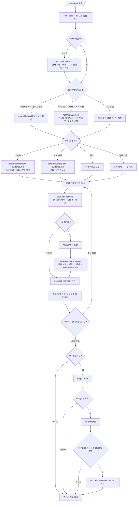

<skill>
  <purpose>
    이슈 하나의 작업이 끝난 시점부터 브랜치 정리까지의 마무리 절차를 한 번에 수행한다.
    핵심은 "말로 끝났다고 하지 않고 증거로 끝낸다"는 것이다.
    프론트엔드는 화면 전/후 webp 캡처, 백엔드는 성능/동작 전후 비교표가 그 증거다.
  </purpose>

  <inputs>
    <arg name="$ARGUMENTS" optional="true">이슈 번호(`#59`, `59`, URL) 또는 추가 지시. 생략 가능</arg>
    <detected>현재 워크트리 여부, 브랜치, 브랜치명에서 추론한 이슈 번호, 기존 PR</detected>
  </inputs>

  <preconditions>
    <item>현재 디렉터리가 git 저장소</item>
    <item>`gh auth status` 통과 (이슈 연동을 건너뛸 때는 선택)</item>
    <item>Node 18+ / 프론트 캡처 시 Playwright</item>
  </preconditions>

  <routing>
    <branch name="frontend" when="변경 파일이 UI 계층(컴포넌트/페이지/스타일/뷰)이거나 이슈가 화면 동작을 다룸">
      references/frontend-evidence.md
    </branch>
    <branch name="backend" when="변경 파일이 API/쿼리/배치/인프라이거나 이슈가 성능·정확성·부하를 다룸">
      references/backend-evidence.md
    </branch>
    <branch name="both" when="풀스택 변경">두 레퍼런스를 모두 읽고 증거 섹션을 두 개로 나눈다</branch>
    <branch name="neither" when="문서/설정 변경으로 캡처도 측정도 의미 없음">
      증거 단계를 건너뛰되 무엇을 왜 건너뛰는지 코멘트에 남긴다
    </branch>
    <always>references/context-triage.md — 상황 판단과 사용자 의도 확인</always>
    <always>references/evidence-commit.md — gitignore 예외, 이중 커밋, 렌더링 URL</always>
    <always>references/wrapup-flow.md — push / PR / merge / 정리 확인 절차</always>
  </routing>

  <hard-rules>
    <rule>push, PR 생성, merge, 브랜치·워크트리 삭제는 매번 사용자 확인을 받는다. 묶어서 한 번에 승인받지 않는다.</rule>
    <rule>증거 이미지는 `git add -f` 와 `.gitignore` 예외를 함께 적용한다. 둘 중 하나만 하지 않는다.</rule>
    <rule>이슈 코멘트에는 작업 브랜치 기준 URL 과 기본 브랜치(또는 evidence 브랜치) 기준 URL 을 모두 넣는다.</rule>
    <rule>이슈 번호를 확정하지 못한 상태에서 임의의 이슈에 코멘트하지 않는다.</rule>
    <rule>측정값·캡처를 지어내지 않는다. 실행하지 못했으면 못 했다고 쓴다.</rule>
  </hard-rules>

  <non-goals>
    <item>기능 구현. 이 스킬은 이미 끝난 작업의 마무리만 한다</item>
    <item>merge 후 배포</item>
    <item>이슈 본문 수정</item>
  </non-goals>
</skill>

# 전체 흐름



# 스크립트 경로

아래 중 **존재하는 첫 번째 경로**를 `<skill>` 로 쓴다.

```text
.claude/skills/issue-end        # 현재 프로젝트 (Claude Code)
.codex/skills/issue-end         # 현재 프로젝트 (Codex)
~/.claude/skills/issue-end      # 홈 설치
~/.codex/skills/issue-end       # 홈 설치
```

# 실행 순서

## 0단계 — 상황 판단

먼저 상태를 읽는다. 추측하지 않는다.

```bash
node <skill>/scripts/issue-end.mjs context
```

출력의 `isLinkedWorktree`, `branch`, `issue`, `issueTitle`, `openPr`, `baseBranch`, `isPrivate` 를 근거로
`references/context-triage.md` 의 분기표를 따라 사용자에게 물을 것만 묻는다.

## 1단계 — 체크리스트 생성

상황이 확정되면 TodoWrite 로 아래 체크리스트를 **그대로** 만든다. 해당 없는 항목은 만들지 않는다.

```text
1. 상황 판단 및 이슈 확정
2. 변경 성격 판정 (frontend / backend / both)
3. 증거 수집 - before
4. 증거 수집 - after
5. 증거 코멘트 초안 작성
6. 증거 커밋 (작업 브랜치)
7. 작업 브랜치 push (확인 필요)
8. 기본 브랜치 미러 커밋/푸시 (확인 필요)
9. 이슈 코멘트 등록
10. 이슈 링크 사용자 확인
11. PR 생성 (확인 필요)
12. merge (확인 필요)
13. 브랜치·워크트리 정리 (확인 필요)
```

각 단계를 끝낼 때마다 즉시 완료 처리한다. 한 번에 여러 개를 완료로 바꾸지 않는다.

## 2단계 — 변경 성격 판정

```bash
git diff --stat "origin/$(node <skill>/scripts/issue-end.mjs context | grep -o '"baseBranch": "[^"]*"' | cut -d'"' -f4)"...HEAD
```

판정 기준:

- 프론트엔드 — `*.tsx`, `*.vue`, `*.svelte`, `styles*`, `components/`, `pages/`, `app/`, css/scss
- 백엔드 — `api/`, `server/`, `service*`, `repository*`, `*.sql`, 마이그레이션, 핸들러, 배치, 워커
- 둘 다 걸리면 both

판정 결과와 근거 파일을 사용자에게 한 줄로 보고한 뒤 해당 레퍼런스를 읽는다.

## 3단계 이후

- 증거 수집: 판정된 레퍼런스를 따른다.
- 커밋과 URL: `references/evidence-commit.md`.
- push 이후 마무리: `references/wrapup-flow.md`.

# 이슈 코멘트 형식

```markdown
## 작업 요약
<무엇을 왜 바꿨는지 3줄 이내>

## 변경 파일
- `path/to/file` — 한 줄 설명

## 증거
<frontend: 전/후 캡처 표 · backend: 성능 비교표>

## 검증
```bash
<실제로 실행한 명령>
```
<결과 요약>

## 남은 이슈
- 없음 / 후속 필요 항목
```

증거 이미지 링크는 반드시 두 벌을 넣는다. 자세한 형식은 `references/evidence-commit.md` 참고.
