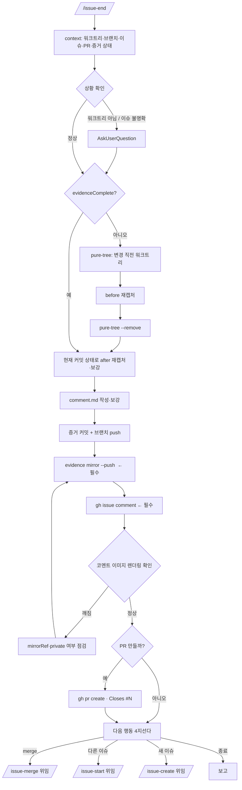

<skill>
  <purpose>
    구현이 끝난 작업을 남들이 검증할 수 있는 상태로 만든다.
    증거를 재확인하고, 기본 브랜치에 증거와 리포트를 남기고, 이슈에 코멘트하고, PR 을 만든다.
    merge 는 하지 않는다. 여러 워크트리를 동시에 굴리는 것이 이 스킬군의 전제이기 때문이다.
  </purpose>

  <inputs>
    <arg name="$ARGUMENTS" optional="true">이슈 번호(`#59`, `59`, URL). 생략하면 브랜치 이름에서 추론</arg>
    <detected>워크트리 여부, 브랜치, 이슈 번호, 기존 PR, 증거 완결성</detected>
  </inputs>

  <preconditions>
    <item>현재 디렉터리가 git 저장소</item>
    <item>`gh auth status` 통과 — 실패하면 `gh-setup` 스킬로 먼저 해결</item>
    <item>Node 18+. 재캡처가 필요하면 Playwright 와 sharp/cwebp/ffmpeg 중 하나</item>
  </preconditions>

  <routing>
    <always>references/context-triage.md — 상황 판단과 확인 질문</always>
    <always>references/evidence-recheck.md — 증거 완결성 검사와 pure-tree 재캡처</always>
    <always>references/report-and-pr.md — 기본 브랜치 증거 커밋 · 이슈 코멘트 · PR</always>
    <always>references/next-actions.md — 다음 행동 4지선다와 issue-merge 위임</always>
  </routing>

  <subagents>
    <agent name="issue-verifier" claude-model="haiku" codex-model="gpt-5.6-luna">
      증거 완결성 점검 · 작업 성격 재판정
    </agent>
  </subagents>

  <hard-rules>
    <rule>증거와 리포트를 기본 브랜치에 커밋·푸시하는 6단계와 이슈에 코멘트하는 7단계는 필수다. 건너뛰지 않는다.</rule>
    <rule>증거가 없으면 PR 을 만들지 않는다. 왜 만들 수 없는지 보고하고 멈춘다.</rule>
    <rule>merge 를 실행하지 않는다. 요청받으면 `issue-merge` 로 위임한다.</rule>
    <rule>워크트리를 삭제하지 않는다. 정리는 `issue-merge` 가 통합 후에 한다.</rule>
    <rule>push 와 PR 생성은 각각 따로 확인받는다. 묶어서 승인받지 않는다.</rule>
    <rule>현재 워크트리에서 브랜치를 갈아타지 않는다. 기본 브랜치 작업은 임시 워크트리에서 한다.</rule>
    <rule>이슈 번호를 확정하지 못한 상태에서 임의의 이슈에 코멘트하지 않는다.</rule>
    <rule>측정값과 캡처를 지어내지 않는다. 악화된 지표도 그대로 적는다.</rule>
  </hard-rules>

  <non-goals>
    <item>기능 구현 — `issue-start` 의 몫</item>
    <item>merge 와 워크트리 정리 — `issue-merge` 의 몫</item>
    <item>이슈 본문 수정 — 코멘트만 단다</item>
  </non-goals>
</skill>

# 전체 흐름



# 스크립트 경로

아래 중 **존재하는 첫 번째 경로**를 `<skill>` 로 쓴다. 하나도 없으면 각 레퍼런스의 인라인 절차를 쓴다.

```text
.claude/skills/issue-end      # 현재 프로젝트 (Claude Code)
.codex/skills/issue-end       # 현재 프로젝트 (Codex)
~/.claude/skills/issue-end    # 홈 설치
~/.codex/skills/issue-end     # 홈 설치
```

`<skill>` 이 `.claude/` 밑이면 실행 계열은 **claude**, `.codex/` 밑이면 **codex** 다.

# 서브에이전트

```text
claude  .claude/agents/issue-verifier.md   (model: haiku)
codex   .codex/agents/issue-verifier.toml  (model = "gpt-5.6-luna")
```

없으면 `migrate-skill-agent.sh --agent issue-verifier --target home --link --clone` 으로 설치한다.
실패하면 기본 서브에이전트로 진행하고 "모델 고정 실패"를 한 줄 보고한다.

# 실행 순서

## 0단계 — 상황 판단

```bash
node <skill>/scripts/issue-end.mjs context
```

출력의 `isLinkedWorktree` / `issue` / `evidenceComplete` / `onBaseBranch` / `openPr` 를 읽고 분기한다.
세부는 `references/context-triage.md`.

## 1단계 — 체크리스트 생성

TodoWrite 로 아래 10개를 만든다. **단계가 끝날 때마다 즉시 완료로 갱신한다.**

```text
1.  상황 판단 (context)
2.  증거 존재·완결성 확인
3.  누락 시 pure-tree 로 before 재캡처
4.  현재 커밋 상태로 after 재캡처·보강
5.  리포트 작성·보강 (comment.md)
6.  증거·리포트를 기본 브랜치에 커밋·푸시   [필수]
7.  이슈에 증거 기반 코멘트                [필수]
8.  코멘트 렌더링 확인
9.  PR 생성
10. 다음 행동 선택
```

6번과 7번의 `[필수]` 표시를 그대로 남긴다. 사용자가 진행 상황을 볼 때 이 둘이 선택이 아님이 드러나야 한다.

## 2~4단계 — 증거 재확인

`issue-start` 가 이미 증거를 만들어 뒀다면 여기서는 **재확인과 보강**만 한다.
`evidenceComplete: false` 면 `pure-tree` 로 변경 직전 상태를 만들어 before 를 다시 찍는다.
세부는 `references/evidence-recheck.md`.

## 5~9단계 — 리포트·미러 커밋·코멘트·PR

`references/report-and-pr.md` 를 따른다. 6·7단계는 조건부가 아니다.

## 10단계 — 다음 행동

`references/next-actions.md` 의 4지선다를 그대로 제시한다.

## 마무리 보고

```text
이슈      #{issue_number} <제목>
브랜치    <이름>
증거      before <n>장 / after <n>장 (박스 <n>개)
미러      <mirrorRef> (fallback 이면 그 사실 명시)
코멘트    <이슈 코멘트 URL>
PR        <PR URL 또는 "만들지 않음 — 사유">
다음      <사용자가 고른 행동>
```
