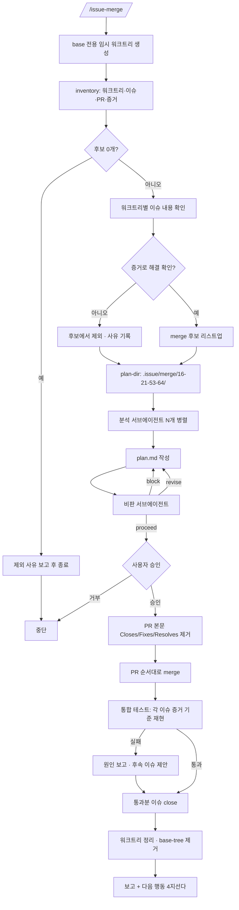

<skill>
  <purpose>
    여러 워크트리에 나뉘어 끝난 작업들을 한꺼번에 기본 브랜치로 합친다.
    개별 PR 을 하나씩 merge 하는 것과 다른 점은, 합친 뒤 서로 깨지지 않았는지 증거 기준으로 재검증한다는 것이다.
    구현과 증거 생성은 `issue-start` 와 `issue-end` 가 이미 끝냈다고 전제한다.
  </purpose>

  <inputs>
    <arg name="$ARGUMENTS" optional="true">대상 이슈 번호 목록. 생략하면 모든 워크트리를 후보로 본다</arg>
    <detected>워크트리 목록, 각 브랜치의 이슈·PR·증거 상태</detected>
  </inputs>

  <preconditions>
    <item>현재 디렉터리가 git 저장소</item>
    <item>`gh auth status` 통과 — 실패하면 `gh-setup` 스킬로 먼저 해결</item>
    <item>Node 18+</item>
  </preconditions>

  <routing>
    <always>references/inventory.md — 워크트리 수집과 이슈 연결</always>
    <always>references/merge-plan.md — 서브에이전트 팬아웃과 계획 수립·검토</always>
    <always>references/verify-and-close.md — merge · 통합 테스트 · 이슈 close</always>
    <always>references/next-actions.md — 통합 뒤 다음 행동 4지선다</always>
  </routing>

  <subagents>
    <agent name="issue-merge-analyst" claude-model="haiku" codex-model="gpt-5.6-luna">
      워크트리 하나씩 분석. 워크트리 개수만큼 병렬로 스폰
    </agent>
    <agent name="issue-merge-critic" claude-model="haiku" codex-model="gpt-5.6-luna">
      계획의 모호성·검증되지 않은 전제·되돌릴 수 없는 순서를 지적
    </agent>
  </subagents>

  <hard-rules>
    <rule>사용자의 작업 트리에서 브랜치를 갈아타지 않는다. base 전용 임시 워크트리에서만 움직인다.</rule>
    <rule>증거로 해결이 확인되지 않은 이슈는 merge 후보에서 뺀다. 커밋 메시지는 근거가 아니다.</rule>
    <rule>비판 서브에이전트가 `block` 을 내면 계획을 고치기 전에는 merge 하지 않는다.</rule>
    <rule>이슈 close 는 통합 테스트 뒤에 한다. 순서를 바꾸지 않는다.</rule>
    <rule>merge 전에 PR 본문의 `Closes/Fixes/Resolves #N` 을 제거한다. 두면 merge 순간 자동 close 되어 위 순서가 깨진다. 제거 실패 시 merge 하지 않는다.</rule>
    <rule>CI 가 실패한 PR 은 merge 하지 않는다.</rule>
    <rule>`evidence/issue-*` 브랜치는 삭제하지 않는다. 증거 URL 이 의존한다.</rule>
    <rule>사용자가 정해야 할 것은 전부 AskUserQuestion 으로 묻는다. 평문 질문으로 끝내지 않는다.</rule>
    <rule>merge 는 AskUserQuestion 으로 승인받은 뒤에 한다. 여러 PR 을 묶어서 한 번에 승인받지 않는다.</rule>
    <rule>사용자에게 말을 걸 때는 — 전이 보고든 질문이든 — 현재 단계를 반드시 함께 밝힌다.
      본문이 5줄 미만이면 앞에, 5줄 이상이면 마지막 줄에 둔다. 형식은 `# 현재 단계 밝히기` 를 따른다.</rule>
  </hard-rules>

  <non-goals>
    <item>기능 구현과 증거 생성 — `issue-start` / `issue-end` 의 몫</item>
    <item>배포</item>
    <item>이슈 본문 수정</item>
  </non-goals>

  <reporting>
    문제가 생기면 아래 순서를 그대로 지켜 보고한다. 세 스킬(issue-start / issue-end / issue-merge)이 같은 형식을 쓴다.

    1. 쉬운 말로 쓴다. 전문 용어를 쓸 거면 바로 옆에 풀어 준다.
    2. 지금 무슨 상황인지부터 말한다.
    3. 무엇이 잘못됐는지 말한다.
    4. 잘못되지 않은 것도 말한다 — 무엇은 멀쩡한지 짚어 준다.
    5. 사용자가 정해야 할 것을 고를 수 있게 물어본다. AskUserQuestion 을 쓴다.
    6. 이슈·PR·코멘트는 `[설명](링크)` 로, 워크트리 경로는 배치에 맞는 형태로 쓴다. `링크와 경로 쓰는 법` 참고.

    문제 상황이 아니어도 사용자에게 말을 걸 때는 현재 단계를 함께 밝힌다.
    다음 단계로 넘어가기 직전의 전이 보고와 승인·확인 질문이 모두 대상이다. `# 현재 단계 밝히기` 를 따른다.
  </reporting>

  <next>
    끝날 때는 항상 다음에 무엇을 할지 골라 준다. references/next-actions.md 의 4지선다를 그대로 쓴다.
  </next>
</skill>

# 전체 흐름

# 현재 단계 밝히기

사용자에게 말을 걸 때는 **지금 어느 스킬의 몇 단계인지** 반드시 함께 적는다. 전이 보고와 AskUserQuestion 질문 본문이 대상이며, 선택지 라벨에는 단계 표기를 넣지 않는다.

## 표기 형식

```text
<스킬 이름> <n>단계(<단계 이름>)

예) issue-merge 6단계(merge · 통합 테스트)
```

## 단계 이름 정본

```text
 0  base 전용 워크트리 준비
 1  워크트리 인벤토리 수집
 2  워크트리↔이슈 매핑 확인
 3  증거 기반 해결 여부 판정 → merge 후보 확정
 4  분석 서브에이전트 팬아웃 → plan.md
 5  비판 서브에이전트로 모호성 검토
 6  merge · 통합 테스트
 7  이슈 close · 정리
 8  다음 행동 선택
```

## 위치는 분량으로 정한다

```text
5줄 미만   단계를 먼저 말하고, 이어서 할 말을 한다
5줄 이상   할 말을 먼저 하고, 마지막에 `현재 단계 — <표기>` 를 한 줄로 남긴다
```

줄 수는 사용자에게 보이는 본문 기준이며 AskUserQuestion 선택지는 세지 않는다. 회차 안에서 대상이 여럿이면 대상 범위도 함께 적는다.

### 5줄 미만 — 앞에 붙인다

```text
issue-merge 5단계(비판 검토)입니다. 계획을 비판 서브에이전트에 넘기겠습니다.
```

### 5줄 이상 — 뒤에 붙인다

```text
후보 3건을 확정했습니다 — #16 #21 #53.

제외 사유와 충돌 후보를 정리했습니다.
통합 순서는 계획에 남겼습니다.
검토가 끝나면 merge 승인을 묻겠습니다.

현재 단계 — issue-merge 3단계(merge 후보 확정)
```

## 질문일 때

질문 본문에 단계 표기를 넣고, 선택지에는 반복하지 않는다.



# 스크립트 경로

아래 중 **존재하는 첫 번째 경로**를 `<skill>` 로 쓴다.

```text
.claude/skills/issue-merge      # 현재 프로젝트 (Claude Code)
.codex/skills/issue-merge       # 현재 프로젝트 (Codex)
~/.claude/skills/issue-merge    # 홈 설치
~/.codex/skills/issue-merge     # 홈 설치
```

`<skill>` 이 `.claude/` 밑이면 실행 계열은 **claude**, `.codex/` 밑이면 **codex** 다.

# 서브에이전트

```text
claude  .claude/agents/issue-merge-analyst.md   (model: haiku)
        .claude/agents/issue-merge-critic.md    (model: haiku)
codex   .codex/agents/issue-merge-analyst.toml  (model = "gpt-5.6-luna")
        .codex/agents/issue-merge-critic.toml   (model = "gpt-5.6-luna")
```

없으면 설치한다.

```bash
sh <migrate-skill-agent>/scripts/migrate-skill-agent.sh --agent issue-merge-analyst --target home --link --clone
sh <migrate-skill-agent>/scripts/migrate-skill-agent.sh --agent issue-merge-critic  --target home --link --clone
```

설치가 안 되면 기본 서브에이전트로 진행하되 "모델 고정 실패"를 한 줄 보고한다.
**비판 단계 자체는 건너뛰지 않는다.** 모델이 무엇이든 계획을 한 번은 깨뜨려 봐야 한다.

# 문제 보고 형식

무언가 막히거나 어긋났을 때는 아래 다섯 줄 순서를 그대로 지킨다. 순서를 바꾸거나 건너뛰지 않는다.

```text
1. 상황      지금 어디까지 왔고 무엇을 하려던 중인지
2. 문제      무엇이 잘못됐는지
3. 멀쩡한 것  무엇은 문제가 없는지 (사용자가 피해 범위를 알아야 한다)
4. 원인      왜 그렇게 됐는지 (아는 만큼만. 모르면 모른다고 쓴다)
5. 선택      사용자가 정해야 할 것 — AskUserQuestion 으로 고를 수 있게
```

**쉬운 말로 쓴다.** 전문 용어는 꼭 필요할 때만 쓰고, 쓸 때는 바로 옆에 풀어 준다.

```text
나쁜 예   detached HEAD 상태에서 rebase 충돌로 인해 워크트리가 dirty 합니다.
좋은 예   지금 워크트리(이슈 하나를 위해 따로 만든 작업 폴더)에 저장 안 된 변경이 남아 있습니다.
```

**"문제 없는 것"을 반드시 적는다.** 사용자는 어디까지 망가졌는지를 가장 먼저 알고 싶어 한다.

```text
문제      증거 이미지를 기본 브랜치에 올리지 못했습니다.
멀쩡한 것  코드 변경과 커밋은 그대로 남아 있습니다. 이슈도 그대로입니다.
```

**마지막은 항상 질문이다.** 사용자가 무엇을 정해야 하는지 모른 채 끝내지 않는다.
선택지는 2~4개, 권장안을 첫 번째에 두고 각 선택의 결과를 한 줄로 적는다.

### 예시

```text
상황      이슈 #59 의 코드 변경과 커밋까지 끝냈고, 증거를 기본 브랜치에 올리는 중이었습니다.
문제      기본 브랜치가 보호되어 있어 올리지 못했습니다.
멀쩡한 것  코드 변경, 커밋, 작업 브랜치 push 는 모두 끝났습니다. 잃은 것은 없습니다.
원인      저장소 설정에서 main 브랜치에 직접 push 를 막아 둔 것으로 보입니다.

질문: issue-merge <n>단계(<단계 이름>)입니다. 증거를 어디에 올릴까요?
- 별도 브랜치에 올리기 (권장)   evidence/issue-59 브랜치를 만들어 올립니다. 이슈의 이미지는 정상 표시됩니다.
- 이미지를 직접 첨부           이슈 웹 페이지에 이미지를 끌어다 놓습니다. 손이 한 번 더 갑니다.
- 증거 없이 진행               이미지 없이 글로만 남깁니다. 나중에 확인이 어려워집니다.
```

# 링크와 경로 쓰는 법

보고·질문·마무리 요약에서 이슈·PR·워크트리를 가리킬 때 아래를 지킨다. 네 스킬(issue-create / issue-start / issue-end / issue-merge)이 같은 규칙을 쓴다.

## 이슈 · PR · 코멘트는 항상 클릭되게

맨 URL 을 그대로 붙이거나 번호만 적지 않는다. `[설명](링크)` 형식으로 쓴다.

```text
나쁜 예   이슈    #59 탭 활성 상태 초기화
          코멘트  https://github.com/owner/repo/issues/59#issuecomment-123

좋은 예   이슈    [#59 탭 활성 상태 초기화](https://github.com/owner/repo/issues/59)
          PR      [#103 fix(tab): 활성 상태 유지](https://github.com/owner/repo/pull/103)
          코멘트  [리포트 보기](https://github.com/owner/repo/issues/59#issuecomment-123)
```

주소는 이미 손에 들어온다. 직접 조립하지 않는다.

```text
gh issue view <n> --json url          이슈 주소
gh pr view <n> --json url             PR 주소
gh issue comment ... 의 출력           방금 단 코멘트 주소
issue-end   context   출력의 issueUrl / openPr.url
issue-merge inventory 출력의 issueUrl / pr.url
```

저장소를 식별하지 못해 주소를 만들 수 없으면 **번호만 적고** 그 사실을 한 줄 남긴다. 없는 링크를 지어내지 않는다.

## 워크트리 경로는 배치에 맞는 형태로

`ctrl+클릭` 으로 열리려면 형태가 배치와 맞아야 한다.

```text
children   저장소 안  → 상대 경로   .issue/worktrees/59-tab-active-state
sibling    저장소 밖  → 절대 경로   /Users/me/work/repo-issue-59
```

sibling 을 상대 경로로 적으면 `../repo-issue-59` 가 되어 **없는 경로로 열린다.** 반대로 children 을 절대 경로로 적으면 쓸데없이 길다.

스크립트가 계산해 둔 값을 그대로 쓴다.

```text
issue-start.mjs worktree   출력의 WORKTREE_DISPLAY=
issue-end.mjs   context    출력의 worktrees[].display
issue-merge.mjs inventory  출력의 worktrees[].display / excluded[].display
```

직접 판단해야 하면 설정이 아니라 **실제 경로**를 본다. `git worktree list` 로 경로를 얻어 저장소 루트 아래면 children, 아니면 sibling 이다. 설정값은 새로 만들 때만 쓰이므로, 이미 있는 워크트리는 예전 설정으로 만들어졌을 수 있다.

# 실행 순서

## 0단계 — 체크리스트와 base 워크트리

TodoWrite 로 아래 9개를 만든다. **단계가 끝날 때마다 즉시 완료로 갱신한다.**

```text
0. base 전용 워크트리 준비
1. 워크트리 인벤토리 수집
2. 워크트리↔이슈 매핑 확인
3. 증거 기반 해결 여부 판정 → merge 후보 확정
4. 분석 서브에이전트 팬아웃 → plan.md
5. 비판 서브에이전트로 모호성 검토
6. 승인 → merge → 통합 테스트
7. 재검증 통과분 이슈 close
8. 다음 행동 선택
```

기본 브랜치로 "변경 이력을 가져가지 않고 checkout" 하되, **사용자의 작업 트리는 건드리지 않는다.**

```bash
node <skill>/scripts/issue-merge.mjs base-tree
```

`.issue/merge/base/` 에 detached 워크트리가 생긴다. 이후 통합 작업은 전부 이 안에서 한다.
이미 있으면 최신 `origin/<base>` 로 맞추기만 한다.

## 1~2단계 — 인벤토리

```bash
node <skill>/scripts/issue-merge.mjs inventory
```

기본 브랜치보다 앞선 커밋이 없는 워크트리는 **자동으로 빠진다.** 합칠 변경이 없어 판단할 것도 없기 때문이다. 조용히 버리지 않고 `excluded` 에 사유와 함께 남으므로, 회차 보고에 한 줄로 남긴다.

`count` 가 0 이면 합칠 것이 없다. 그 사실과 제외 사유만 보고하고 끝낸다. 계획을 세우거나 서브에이전트를 띄우지 않는다.

세부는 `references/inventory.md`.

## 3단계 — 해결 여부 판정

각 워크트리의 이슈 완료 기준과 증거를 대조한다. `references/inventory.md` 의 판정 규칙을 따른다.

## 4~5단계 — 계획 수립과 검토

```bash
node <skill>/scripts/issue-merge.mjs plan-dir 16 21 53 64
```

`.issue/merge/16-21-53-64/` 가 생긴다. 여기에 `plan.md` 와 `review.md` 를 쓴다.
세부는 `references/merge-plan.md`.

## 6~7단계 — merge · 재검증 · close

`references/verify-and-close.md` 를 따른다.

`close` 는 이슈를 닫기 직전에 진행 상태 라벨을 `status:close` 로 교체한다(자동). 별도 호출이 필요 없다.

## 8단계 — 다음 행동

`references/next-actions.md` 의 4지선다를 그대로 제시한다.

## 마무리 보고

```text
대상        <n>개 워크트리 / [#16](url) [#21](url) [#53](url) [#64](url)
merge 됨    [#16](url) [#21](url) [#53](url)
보류        [#64](url) — <사유>
통합 테스트  <통과/실패 요약>
close 됨    [#16](url) [#21](url) [#53](url) (status:close)
정리        워크트리 <n>개 제거 / base-tree 제거
남은 것     <다음에 해야 할 것>
다음        <사용자가 고른 행동>

현재 단계 — issue-merge 8단계(다음 행동 선택) 완료
```

이슈 번호는 `inventory` 출력의 `issueUrl` 로 링크를 만든다. 워크트리 경로는 `display` 값을 쓴다.
