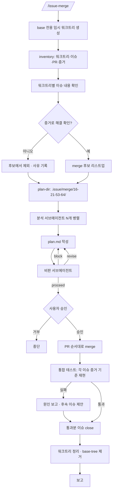

<skill>
  <purpose>
    여러 워크트리에 나뉘어 끝난 작업들을 한꺼번에 기본 브랜치로 합친다.
    개별 PR 을 하나씩 merge 하는 것과 다른 점은, 합친 뒤 서로 깨지지 않았는지 증거 기준으로 재검증한다는 것이다.
    구현과 증거 생성은 `issue-start` 와 `issue-end` 가 이미 끝냈다고 전제한다.
  </purpose>

  <inputs>
    <arg name="$ARGUMENTS" optional="true">대상 이슈 번호 목록. 생략하면 모든 워크트리를 후보로 본다</arg>
    <detected>워크트리 목록, 각 브랜치의 이슈·PR·증거 상태</detected>
  </inputs>

  <preconditions>
    <item>현재 디렉터리가 git 저장소</item>
    <item>`gh auth status` 통과 — 실패하면 `gh-setup` 스킬로 먼저 해결</item>
    <item>Node 18+</item>
  </preconditions>

  <routing>
    <always>references/inventory.md — 워크트리 수집과 이슈 연결</always>
    <always>references/merge-plan.md — 서브에이전트 팬아웃과 계획 수립·검토</always>
    <always>references/verify-and-close.md — merge · 통합 테스트 · 이슈 close</always>
  </routing>

  <subagents>
    <agent name="issue-merge-analyst" claude-model="haiku" codex-model="gpt-5.6-luna">
      워크트리 하나씩 분석. 워크트리 개수만큼 병렬로 스폰
    </agent>
    <agent name="issue-merge-critic" claude-model="haiku" codex-model="gpt-5.6-luna">
      계획의 모호성·검증되지 않은 전제·되돌릴 수 없는 순서를 지적
    </agent>
  </subagents>

  <hard-rules>
    <rule>사용자의 작업 트리에서 브랜치를 갈아타지 않는다. base 전용 임시 워크트리에서만 움직인다.</rule>
    <rule>증거로 해결이 확인되지 않은 이슈는 merge 후보에서 뺀다. 커밋 메시지는 근거가 아니다.</rule>
    <rule>비판 서브에이전트가 `block` 을 내면 계획을 고치기 전에는 merge 하지 않는다.</rule>
    <rule>이슈 close 는 통합 테스트 뒤에 한다. 순서를 바꾸지 않는다.</rule>
    <rule>CI 가 실패한 PR 은 merge 하지 않는다.</rule>
    <rule>`evidence/issue-*` 브랜치는 삭제하지 않는다. 증거 URL 이 의존한다.</rule>
    <rule>merge 는 사용자 승인 후에 한다. 여러 PR 을 묶어서 한 번에 승인받지 않는다.</rule>
  </hard-rules>

  <non-goals>
    <item>기능 구현과 증거 생성 — `issue-start` / `issue-end` 의 몫</item>
    <item>배포</item>
    <item>이슈 본문 수정</item>
  </non-goals>
</skill>

# 전체 흐름



# 스크립트 경로

아래 중 **존재하는 첫 번째 경로**를 `<skill>` 로 쓴다.

```text
.claude/skills/issue-merge      # 현재 프로젝트 (Claude Code)
.codex/skills/issue-merge       # 현재 프로젝트 (Codex)
~/.claude/skills/issue-merge    # 홈 설치
~/.codex/skills/issue-merge     # 홈 설치
```

`<skill>` 이 `.claude/` 밑이면 실행 계열은 **claude**, `.codex/` 밑이면 **codex** 다.

# 서브에이전트

```text
claude  .claude/agents/issue-merge-analyst.md   (model: haiku)
        .claude/agents/issue-merge-critic.md    (model: haiku)
codex   .codex/agents/issue-merge-analyst.toml  (model = "gpt-5.6-luna")
        .codex/agents/issue-merge-critic.toml   (model = "gpt-5.6-luna")
```

없으면 설치한다.

```bash
sh <migrate-skill-agent>/scripts/migrate-skill-agent.sh --agent issue-merge-analyst --target home --link --clone
sh <migrate-skill-agent>/scripts/migrate-skill-agent.sh --agent issue-merge-critic  --target home --link --clone
```

설치가 안 되면 기본 서브에이전트로 진행하되 "모델 고정 실패"를 한 줄 보고한다.
**비판 단계 자체는 건너뛰지 않는다.** 모델이 무엇이든 계획을 한 번은 깨뜨려 봐야 한다.

# 실행 순서

## 0단계 — 체크리스트와 base 워크트리

TodoWrite 로 아래 8개를 만든다. **단계가 끝날 때마다 즉시 완료로 갱신한다.**

```text
0. base 전용 워크트리 준비
1. 워크트리 인벤토리 수집
2. 워크트리↔이슈 매핑 확인
3. 증거 기반 해결 여부 판정 → merge 후보 확정
4. 분석 서브에이전트 팬아웃 → plan.md
5. 비판 서브에이전트로 모호성 검토
6. 승인 → merge → 통합 테스트
7. 재검증 통과분 이슈 close
```

기본 브랜치로 "변경 이력을 가져가지 않고 checkout" 하되, **사용자의 작업 트리는 건드리지 않는다.**

```bash
node <skill>/scripts/issue-merge.mjs base-tree
```

`.issue/merge/base/` 에 detached 워크트리가 생긴다. 이후 통합 작업은 전부 이 안에서 한다.
이미 있으면 최신 `origin/<base>` 로 맞추기만 한다.

## 1~2단계 — 인벤토리

```bash
node <skill>/scripts/issue-merge.mjs inventory
```

세부는 `references/inventory.md`.

## 3단계 — 해결 여부 판정

각 워크트리의 이슈 완료 기준과 증거를 대조한다. `references/inventory.md` 의 판정 규칙을 따른다.

## 4~5단계 — 계획 수립과 검토

```bash
node <skill>/scripts/issue-merge.mjs plan-dir 16 21 53 64
```

`.issue/merge/16-21-53-64/` 가 생긴다. 여기에 `plan.md` 와 `review.md` 를 쓴다.
세부는 `references/merge-plan.md`.

## 6~7단계 — merge · 재검증 · close

`references/verify-and-close.md` 를 따른다.

## 마무리 보고

```text
대상        <n>개 워크트리 / 이슈 #16 #21 #53 #64
merge 됨    #16 #21 #53
보류        #64 — <사유>
통합 테스트  <통과/실패 요약>
close 됨    #16 #21 #53
정리        워크트리 <n>개 제거 / base-tree 제거
남은 것     <다음에 해야 할 것>
```
