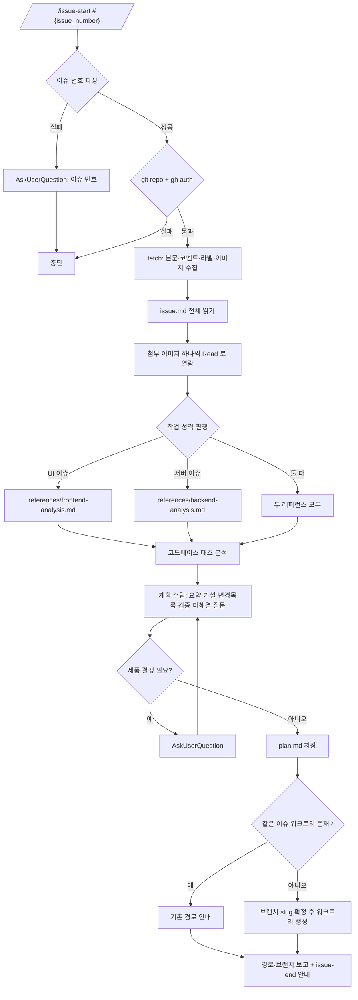

<skill>
  <purpose>
    이슈 하나를 착수하기 직전에 필요한 것을 한 번에 준비한다.
    스크린샷까지 실제로 열어보고, 코드와 대조해 원인 가설을 세우고, 팀 공통 규칙으로 브랜치와 워크트리를 만든다.
    구현은 하지 않는다. 마무리는 `issue-end` 스킬이 맡는다.
  </purpose>

  <inputs>
    <arg name="$ARGUMENTS" required="true">이슈 번호 (`#{issue_number}`, `{issue_number}`, 이슈 URL) + 선택적 추가 지시</arg>
  </inputs>

  <preconditions>
    <item>현재 디렉터리가 git 저장소</item>
    <item>`gh auth status` 통과 — 실패하면 `gh-setup` 스킬로 설치·로그인을 먼저 끝낸다</item>
    <item>git, curl, Node 18+</item>
  </preconditions>

  <routing>
    <always>references/issue-collection.md — 이슈·코멘트·이미지 수집과 열람</always>
    <branch name="frontend" when="라벨/본문/스크린샷이 화면 동작을 가리키거나 UI 계층 변경이 예상됨">
      references/frontend-analysis.md
    </branch>
    <branch name="backend" when="API·쿼리·성능·데이터 정합성·배치를 다룸">
      references/backend-analysis.md
    </branch>
    <branch name="both" when="풀스택 이슈">두 레퍼런스를 모두 읽고 계획을 계층별로 나눈다</branch>
    <always>references/worktree.md — 브랜치 이름 규칙과 워크트리 생성</always>
  </routing>

  <hard-rules>
    <rule>코드를 수정하지 않는다. 분석·계획·워크트리 준비까지만 한다.</rule>
    <rule>현재 워크트리에서 브랜치를 갈아타지 않는다.</rule>
    <rule>이슈 상태 변경, 코멘트 작성, PR 생성을 하지 않는다.</rule>
    <rule>첨부 이미지는 요약만 믿지 않고 Read 로 직접 열어본다.</rule>
    <rule>이슈 번호를 못 찾으면 AskUserQuestion 으로 묻고 중단한다.</rule>
  </hard-rules>

  <handoff>
    작업이 끝나면 같은 워크트리에서 `issue-end` 스킬을 실행한다.
    `issue-start` 가 받아 둔 `.issue-start/<번호>/images/` 는 `issue-end` 의 before 증거로 재사용한다.
  </handoff>
</skill>

# 전체 흐름



# 스크립트 경로

아래 중 **존재하는 첫 번째 경로**를 `<skill>` 로 쓴다. 하나도 없으면 각 레퍼런스의 인라인 절차를 그대로 수행한다.

```text
.claude/skills/issue-start      # 현재 프로젝트 (Claude Code)
.codex/skills/issue-start       # 현재 프로젝트 (Codex)
~/.claude/skills/issue-start    # 홈 설치
~/.codex/skills/issue-start     # 홈 설치
```

# 실행 순서

## 0단계 — 인자 파싱과 전제 확인

`$ARGUMENTS` 에서 이슈 번호를 뽑는다. `#{issue_number}`, `{issue_number}`, `https://github.com/o/r/issues/{issue_number}` 모두 허용.
못 찾으면 AskUserQuestion 으로 묻고 중단한다.

```bash
git rev-parse --show-toplevel
gh auth status
```

`gh` 쪽이 실패하면 **`gh-setup` 스킬을 실행해** 설치·로그인을 끝낸 뒤 이어서 진행한다.
`gh-setup` 이 없거나 git 저장소가 아니면 그 사실을 먼저 알리고 중단한다.

## 1단계 — 체크리스트 생성

TodoWrite 로 아래를 만든다.

```text
1. 이슈 수집 (본문·코멘트·이미지)
2. 이슈 본문 정독 + 이미지 열람
3. 작업 성격 판정 (frontend / backend / both)
4. 코드베이스 대조 분석
5. 계획 수립 및 plan.md 저장
6. 브랜치·워크트리 생성
7. 결과 보고
```

## 2단계 — 이슈 수집

```bash
node <skill>/scripts/issue-start.mjs fetch {issue_number}
```

세부는 `references/issue-collection.md`. 스크립트가 없는 환경이면 같은 문서의 인라인 절차를 쓴다.

## 3단계 — 작업 성격 판정

라벨, 본문 키워드, 첨부 스크린샷 유무로 판정한다.

```text
frontend 신호   스크린샷 첨부, "화면/버튼/레이아웃/깨짐/반응형", 라벨 ui·design·frontend
backend 신호    "느림/타임아웃/500/중복/정합성/쿼리", 라벨 api·performance·backend·db
both            사용자 플로우 전체를 다루거나 API 계약 변경이 화면에 영향
```

판정 결과와 근거를 한 줄로 보고한 뒤 해당 레퍼런스를 읽는다.

## 4단계 — 대조 분석과 계획

레퍼런스의 조사 항목을 채운다. 탐색 범위가 넓으면 Explore 에이전트에 위임한다.
계획은 `.issue-start/<번호>/plan.md` 로 저장한다.

계획 문서 구성:

1. **이슈 요약** — 문제 / 요구사항 / 완료 기준 (이미지에서 읽어낸 내용 포함)
2. **원인 가설** — 근거가 되는 `path:line`
3. **작업 계획** — 순서 있는 변경 목록, 파일 단위
4. **검증 방법** — 저장소의 실제 스크립트를 확인해 명령을 특정
5. **증거 계획** — `issue-end` 에서 무엇을 캡처/측정할지 미리 정한다
6. **미해결 질문** — 제품 결정이 필요하면 AskUserQuestion

## 5단계 — 워크트리 생성

`references/worktree.md` 를 따른다.

## 마무리 보고

```text
이슈      #{issue_number} <제목>
핵심 발견  <3줄 이내>
계획      .issue-start/{issue_number}/plan.md
워크트리   <경로>
브랜치    <이름>
다음      cd <경로> 후 작업, 끝나면 issue-end 실행
```
