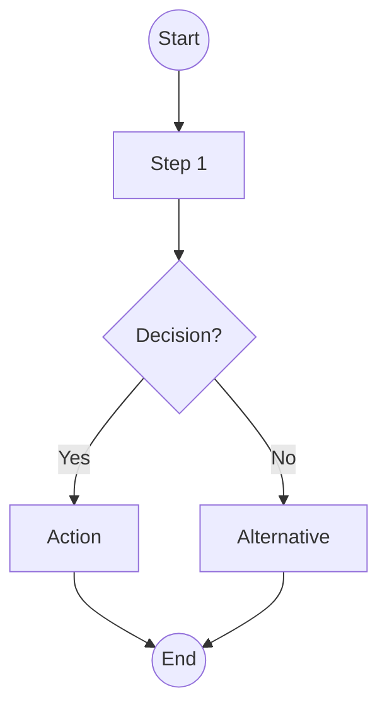

# [Project Name] - Planning Document

> Generated by webapp-planner skill

## 1. Project Overview

### Problem Statement
[What problem does this solve?]

### Target Users
[Who will use this? What are their characteristics?]

### Success Criteria
- [ ] [Metric 1]
- [ ] [Metric 2]
- [ ] [Metric 3]

---

## 2. Requirements Summary

### Must Have (MVP Critical)
| Feature | Description | User Story |
|---------|-------------|------------|
| | | As a [user], I want [feature] so that [benefit] |

### Should Have
| Feature | Description | User Story |
|---------|-------------|------------|
| | | |

### Could Have
| Feature | Description | User Story |
|---------|-------------|------------|
| | | |

### Won't Have (Out of Scope)
- [Feature] - Reason: [Why excluded]

---

## 3. UI/UX Design

### Screen: [Screen Name]

```
[ASCII wireframe here]
```

**Annotations**:
1. [Element] - [UX rationale with Norman/Nielsen reference]
2. [Element] - [UX rationale]

**Tailwind Classes**:
- Container: `[classes]`
- Main elements: `[classes]`

### Screen: [Another Screen]

```
[ASCII wireframe]
```

---

## 4. User Flows

### Flow: [Flow Name]



**Description**: [What this flow accomplishes]

---

## 5. Data Model

### Collections

#### Collection: `[name]`
```typescript
interface [Name] {
  id: string
  // fields
  createdAt: string
  updatedAt: string
}
```

**Operations**:
- Create: [When/how]
- Read: [When/how]
- Update: [When/how]
- Delete: [When/how]

### Repository Structure

```javascript
class [Name]Repository extends BaseRepository {
  // Custom methods
}
```

---

## 6. Technical Specifications

### Tech Stack
| Layer | Technology | Rationale |
|-------|------------|-----------|
| Structure | HTML5 | Semantic, accessible |
| Styling | Tailwind CSS | Utility-first, consistent |
| Logic | Vanilla JavaScript | No build, universal |
| Storage | localbase (IndexedDB) | Structured, 50MB+ capacity |
| Settings | LocalStorage | Quick access, simple data |

### Folder Structure
```
project/
├── index.html
├── css/
│   └── styles.css
├── js/
│   ├── app.js
│   ├── repositories/
│   └── utils/
└── assets/
```

---

## 7. Animation & Interactions

### Component: [Name]
**Trigger**: [hover/click/load]
**Animation**: [Description]

```html
<element class="[Tailwind animation classes]">
```

### Micro-interactions
| Element | Trigger | Effect |
|---------|---------|--------|
| Button | Hover | Scale 105%, shadow |
| Card | Hover | Lift -2px, shadow-xl |
| Input | Focus | Ring-2, border-blue |

---

## 8. Development Phases

### Phase 1: Foundation (Week 1-2)
**Goal**: [Goal]

#### Tasks
- [ ] [Task 1]
- [ ] [Task 2]

#### Exit Criteria
- [ ] [Criterion]

### Phase 2: Core Features (Week 3-6)
**Goal**: [Goal]

#### Tasks
- [ ] [Task 1]
- [ ] [Task 2]

### Phase 3: Enhancement (Week 7-10)
**Goal**: [Goal]

### Phase 4: Polish & Launch (Week 11-12)
**Goal**: [Goal]

---

## 9. Prioritization Analysis

### RICE Scores
| Feature | Reach | Impact | Confidence | Effort | Score |
|---------|-------|--------|------------|--------|-------|
| | | | | | |

### Kano Categories
| Category | Features |
|----------|----------|
| Must-be | |
| Performance | |
| Excitement | |

---

## 10. Milestones

| Milestone | Date | Criteria |
|-----------|------|----------|
| M1: Foundation | Week 2 | Project builds, basic UI |
| M2: Alpha | Week 6 | Core features, data works |
| M3: Beta | Week 10 | All features, tested |
| M4: Launch | Week 12 | Production ready |

---

## 11. Risks & Mitigations

| Risk | Probability | Impact | Mitigation |
|------|-------------|--------|------------|
| | Low/Med/High | Low/Med/High | |

---

## 12. Open Questions

- [ ] [Question 1]
- [ ] [Question 2]

---

## Appendix

### A. Interview Notes
[Summary of customer interview]

### B. Reference Links
- [Link 1]
- [Link 2]

### C. Revision History
| Date | Version | Changes |
|------|---------|---------|
| | 1.0 | Initial draft |
