# Mermaid Diagram Patterns

Patterns for creating flowcharts based on ai-diagrams-toolkit style.

## Flowchart Basics

### Syntax

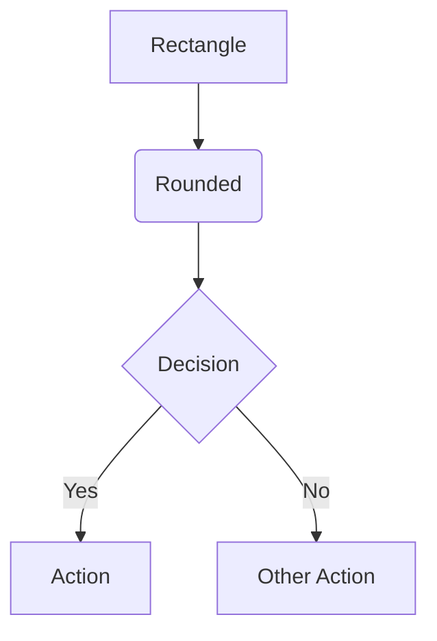

### Node Shapes

```
[Rectangle]     - Process/Action
(Rounded)       - Start/End
{Diamond}       - Decision
[[Subroutine]]  - Sub-process
[(Database)]    - Data store
((Circle))      - Connector
>Asymmetric]    - Input/Output
```

### Directions

```
TD / TB   - Top to Down
BT        - Bottom to Top
LR        - Left to Right
RL        - Right to Left
```

## User Flow Pattern

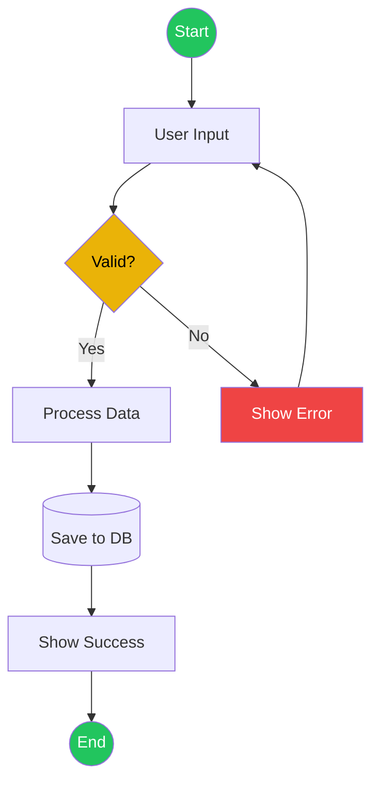

## CRUD Flow Pattern

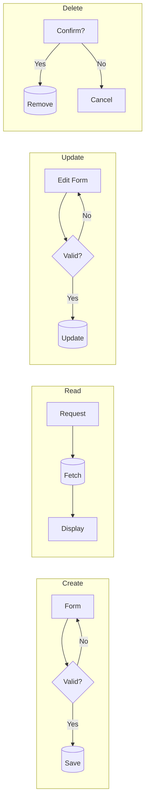

## Authentication Flow

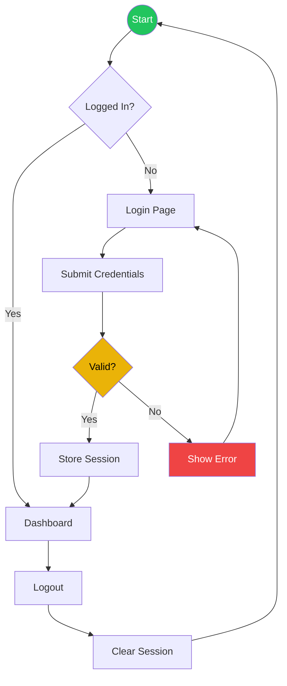

## State Machine Pattern

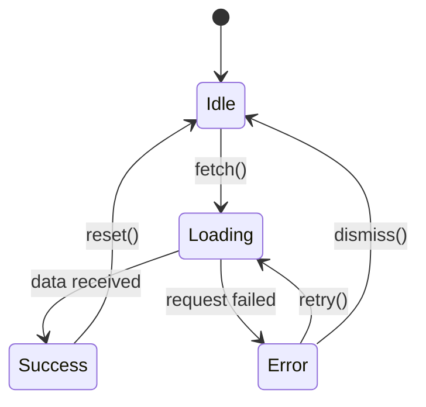

## Sequence Diagram Pattern

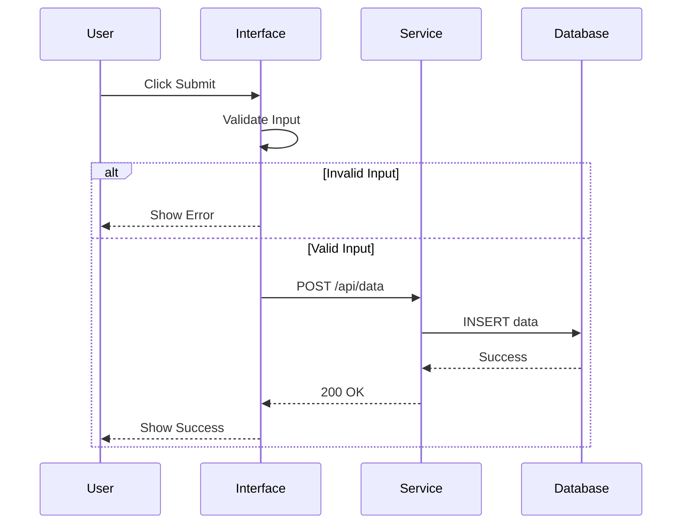

## Component Architecture

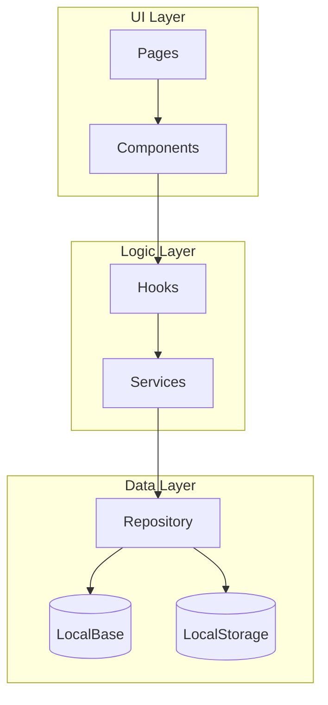

## Error Handling Flow

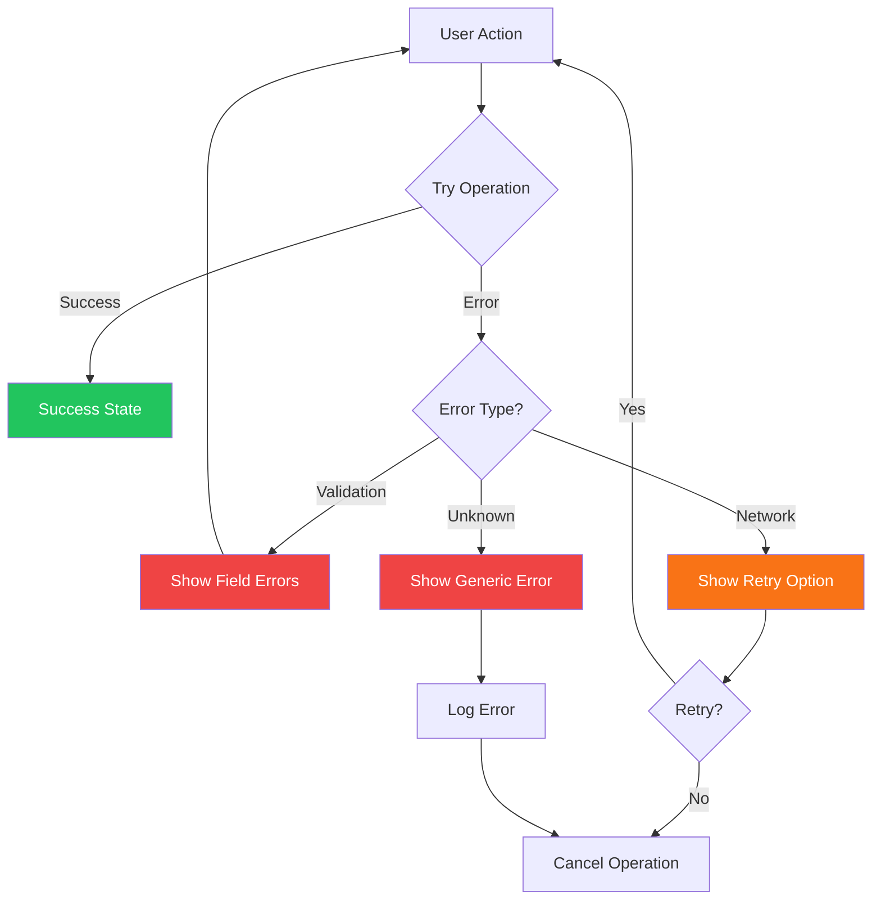

## Color Conventions

Based on ai-diagrams-toolkit semantic colors:

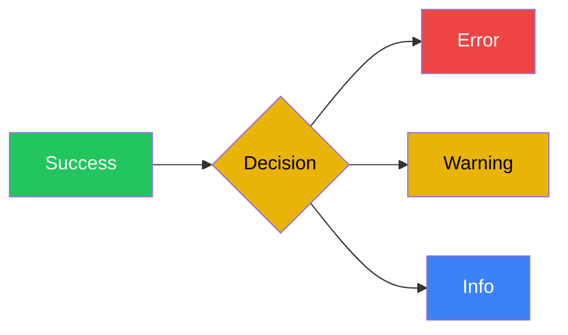

| Color | Hex | Use |
|-------|-----|-----|
| Green | #22c55e | Success, Start, End |
| Red | #ef4444 | Error, Failure |
| Yellow | #eab308 | Decision, Warning |
| Blue | #3b82f6 | Information, Process |
| Gray | #6b7280 | Neutral, Disabled |

## Subgraph Pattern

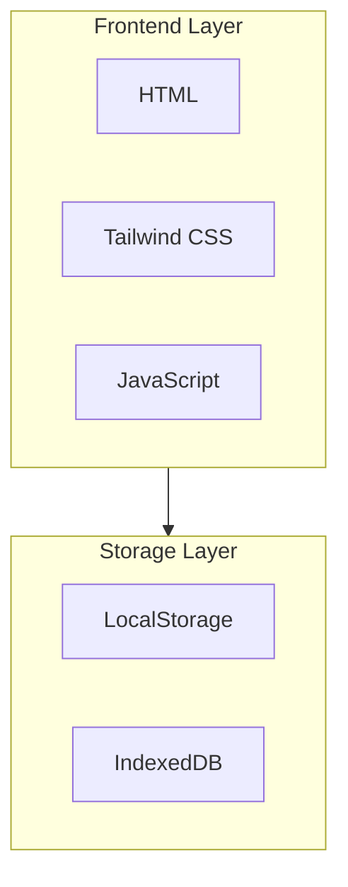

## Best Practices

### DO
- Use semantic colors consistently
- Keep diagrams focused (one flow per diagram)
- Label all edges with conditions
- Use subgraphs for logical grouping
- Include start/end nodes

### DON'T
- Create overly complex diagrams (>15 nodes)
- Mix multiple flows in one diagram
- Use unlabeled decision branches
- Forget error paths
- Skip validation steps

## Template

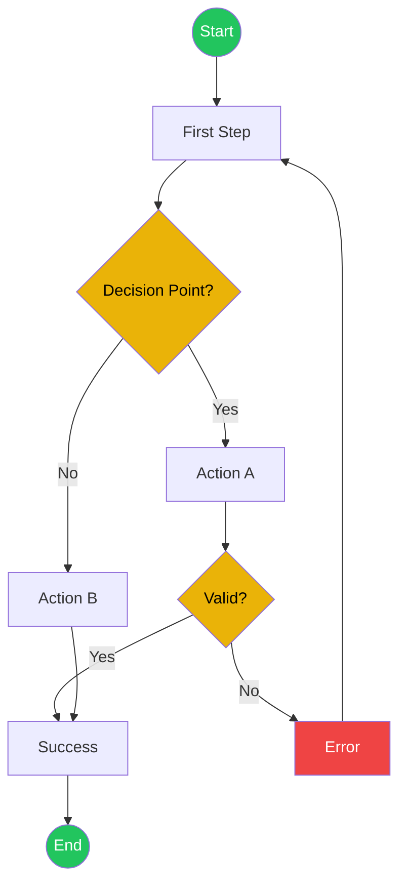
