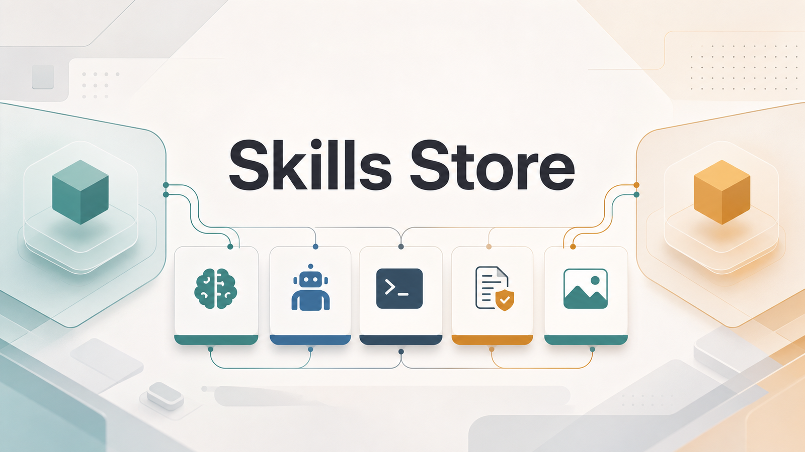

# Skills Store



Codex와 Claude Code에서 같이 쓰는 스킬, agent, 명령, 프로젝트 룰을 모아 둔 저장소입니다.

자주 쓰는 순서는 `visual-companion`, `kill-process`, `install-skill`, `migrate-skill-agent`, `irasutoya-search`, E2E 계열 스킬, `loop`/`schedule`, 문서/프롬프트/agent 순입니다.

## 빠른 사용 순서

1. 시각적 선택지나 와이어프레임이 필요하면 `visual-companion`을 먼저 씁니다.
2. 로컬 개발 서버 포트가 막히면 `kill-process`로 포트를 비웁니다.
3. 외부 GitHub 스킬을 가져와야 하면 `install-skill`을 씁니다.
4. 이 저장소의 특정 skill이나 agent를 홈 또는 현재 프로젝트로 동기화해야 하면 `migrate-skill-agent`를 씁니다.
5. 발표자료나 문서에 넣을 이라스토야 일러스트가 필요하면 `irasutoya-search`를 씁니다.
6. E2E 계획, 생성, 치유, 하네스 작업은 E2E 그룹에서 고릅니다.
7. 영어 원문 기반 한국어 발표자료를 다듬을 때는 `slide-ko-polish`로 번역체와 줄바꿈을 같이 봅니다.
8. 문서 AI-feel 점검, 프롬프트 설계, agent 호출은 작업 성격에 맞춰 선택합니다.
9. Codex 프롬프트를 정해진 간격으로 반복하려면 `loop`, cron이나 특정 시각에 예약하려면 `schedule`을 씁니다.
10. GitHub 이슈 작업은 네 스킬이 단계를 나눠 맡습니다. `issue-create`로 등록하고, `issue-start`로 계획·구현·커밋·증거·이슈 리포트까지 끝내고, `issue-end`로 증거를 재확인해 기본 브랜치에 커밋하고 이슈에 코멘트한 뒤 PR을 올리고, `issue-merge`로 여러 워크트리를 모아 통합·재검증합니다 (`issue-create` → `issue-start` → `issue-end` → `issue-merge`). `gh`가 준비되지 않았으면 `gh-setup`이 먼저 끼어듭니다.

## 저장소 구조

```text
.
├── AGENTS.md
├── CLAUDE.md
├── LICENSE
├── README.md
├── assets/
│   └── images/
├── scripts/
├── tools/
│   └── issue-common.mjs
├── .claude/
│   ├── agents/
│   ├── commands/
│   ├── rules/
│   └── skills/
└── .codex/
    ├── agents/
    ├── config.toml
    ├── rules/
    └── skills/
```

## 사용법 가이드

<details open>
<summary><strong>1. visual-companion</strong> - 브라우저로 보는 시각 선택 도구</summary>

### Best use case

`visual-companion`은 기획 문서, 요구사항, 인터뷰 중 말로만 설명하기 어려운 선택지를 브라우저 화면으로 보여줄 때 씁니다.

텍스트 질문만으로는 서로 같은 장면을 떠올리고 있는지 확인하기 어렵습니다. 특히 화면 구성, 플로우, 정보 구조, 비교안처럼 시각적 판단이 필요한 주제는 말로만 좁히면 오해가 생기기 쉽습니다.

이 스킬은 그런 순간에 선택지, 와이어프레임, 다이어그램, 비교안을 브라우저에 띄웁니다. 사용자가 고른 값이나 짧은 입력을 다시 세션으로 가져와 다음 인터뷰나 기획 문서에 씁니다.

적합한 작업:

- [ouroboros](https://github.com/Q00/ouroboros) `interview` 중 시각 선택지가 필요한 요구사항 정리
- [oh-my-claudecode](https://github.com/Yeachan-Heo/oh-my-claudecode) `deep-interview`에서 사용자가 브라우저로 고른 값을 Claude Code가 이어받는 흐름
- 기획 문서 작성 중 레이아웃, 정보 구조, 사용자 흐름, 다이어그램을 눈으로 보고 골라야 하는 순간

부적합한 작업:

- 단순 텍스트 질문
- API 설계, 데이터 모델링처럼 표나 문장으로 충분한 결정
- 시각 자료 없이 가능한 요구사항 정리

### Hermes Agent 호출 예시

```text
ooo interview "결제 플로우 요구사항이 말로만 정리되어 애매합니다" UI/UX 에 대한 결정을 해야하는 질문에서는 visual-companion 스킬을 사용해서 인터뷰를 이어서 진행하세요.
```

### Codex 호출 예시

```text
$ouroboros interview "결제 플로우 요구사항이 말로만 정리되어 애매합니다" UI/UX 에 대한 결정을 해야하는 질문에서는 $visual-companion 스킬을 사용해서 인터뷰를 이어서 진행하세요.
```

```text
$deep-interview "결제 플로우 요구사항이 말로만 정리되어 애매합니다" UI/UX 에 대한 결정을 해야하는 질문에서는 $visual-companion 스킬을 사용해서 인터뷰를 이어서 진행하세요.
```

### Claude Code 호출 예시

```text
/ouroboros interview "랜딩 페이지 방향을 정해야 해." UI/UX 에 대한 결정을 해야하는 질문에서는 $visual-companion 스킬을 사용해서 인터뷰를 이어서 진행하세요.
```

```text
/deep-interview "랜딩 페이지 방향을 정해야 해." UI/UX 에 대한 결정을 해야하는 질문에서는 $visual-companion 스킬을 사용해서 인터뷰를 이어서 진행하세요.
```

</details>

<details>
<summary><strong>2. kill-process</strong> - 포트 점유 프로세스 종료</summary>

### Best use case

개발 서버를 다시 띄우려는데 `3000`, `5173`, `8080` 같은 포트가 이미 사용 중일 때 씁니다.

### Codex 호출 예시

```text
$kill-process 3000
```

```text
kill-process 스킬로 3000번과 5173번 포트를 비우고, 종료 후 포트가 비었는지 확인해줘.
```

### Claude Code 호출 예시

```text
/kill-process 3000
```

```text
/kill-process 3000 5173
```

### 동작

1. `lsof -ti :<port>`로 PID를 찾습니다.
2. PID가 있으면 프로세스를 종료합니다.
3. 같은 포트를 다시 확인해 비워졌는지 검증합니다.

</details>

<details>
<summary><strong>3. install-skill</strong> - GitHub 스킬 설치</summary>

### Best use case

GitHub 저장소의 특정 스킬 폴더를 현재 프로젝트의 `.codex/skills/` 또는 `.claude/skills/`로 내려받을 때 씁니다.

### Codex 호출 예시

```text
$install-skill https://github.com/Mineru98/skills-store/tree/main/.codex/skills/visual-companion
```

```text
install-skill로 아래 Codex 스킬을 전역 스킬 폴더에 설치해줘.
https://github.com/Mineru98/skills-store/tree/main/.codex/skills/kill-process
```

### Claude Code 호출 예시

```text
install-skill 스킬로 아래 Claude Code 스킬을 설치해줘.
https://github.com/Mineru98/skills-store/tree/main/.claude/skills/visual-companion
```

```text
GitHub의 .claude/skills/premium-korean-aesthetic 폴더를 현재 프로젝트 Claude 스킬로 설치해줘.
https://github.com/Mineru98/skills-store/tree/main/.claude/skills/premium-korean-aesthetic
```

### 포함 파일

```text
.codex/skills/install-skill/script/install-skill.js
.claude/skills/install-skill/script/install-skill.js
```

</details>

<details>
<summary><strong>4. migrate-skill-agent</strong> - skills-store 항목 동기화</summary>

### Best use case

`skills-store`에 있는 특정 skill 또는 agent를 홈 디렉터리나 현재 프로젝트의 `.codex/`와 `.claude/` 자산으로 가져올 때 씁니다.

외부 GitHub URL을 직접 내려받는 `install-skill`과 달리, 이 스킬은 로컬 `skills-store` 저장소를 찾아 `git pull`로 최신화한 뒤 지정한 항목만 복사합니다.

### Codex 호출 예시

```text
$migrate-skill-agent --skill slide-ko-polish --target home
```

```text
$migrate-skill-agent --agent songcopy --target project
```

### Claude Code 호출 예시

```text
migrate-skill-agent 스킬로 slide-ko-polish를 홈 디렉터리에 설치해줘.
```

```text
migrate-skill-agent 스킬로 songcopy agent를 현재 프로젝트에 설치해줘.
```

### 옵션

- `--skill <name>`: skill만 검색해서 설치
- `--agent <name>`: agent만 검색해서 설치
- `--target home`: `~/.codex`와 `~/.claude` 아래에 설치
- `--target project`: 현재 프로젝트의 `.codex`와 `.claude` 아래에 설치

### 포함 파일

```text
.codex/skills/migrate-skill-agent/scripts/migrate-skill-agent.sh
.claude/skills/migrate-skill-agent/scripts/migrate-skill-agent.sh
```

</details>

<details>
<summary><strong>5. irasutoya-search</strong> - 이라스토야 일러스트 검색</summary>

### Best use case

발표자료, 블로그, 문서, 채팅에 넣을 귀여운 무료 일러스트가 필요할 때 씁니다.

사용자의 한국어/영어 설명을 일본어 검색어로 줄여 `irasutoya` CLI를 실행하고, 제목, 페이지 URL, 이미지 URL, 매칭 이유를 보고합니다. 새 이미지를 생성하지 않고 이라스토야 기존 카탈로그만 검색합니다.

### Codex 호출 예시

```text
$irasutoya-search
발표 자료에 쓸 건데, 뭔가 신기한 걸 발견하고 궁금해하는 남자아이 일러스트 하나 찾아줘.
```

```bash
irasutoya search "不思議 男の子"
irasutoya random
```

### Claude Code 호출 예시

```text
irasutoya-search 스킬로 컴퓨터 앞에서 곤란해하는 회사원 이미지를 찾아줘.
```

```bash
irasutoya search "困った 会社員"
```

### 포함 파일

```text
.codex/skills/irasutoya-search/SKILL.md
.codex/skills/irasutoya-search/agents/openai.yaml
.claude/skills/irasutoya-search/SKILL.md
.claude/skills/irasutoya-search/evals/evals.json
```

</details>

<details>
<summary><strong>6. E2E 관련 스킬 그룹</strong></summary>

### 추천 순서

1. `e2e-flow-planner` - Critical User Flow 기반 E2E 계획서 작성
2. `e2e-harness-setup` - E2E 테스트 하네스와 운영 규칙 부트스트랩
3. `e2e-test-generator` - 검토된 계획서를 Playwright 테스트로 구현
4. `e2e-test-hardener` - 생성된 테스트의 독립성, 모킹, 플래키 예방 보강
5. `e2e-test-healer` - 실패한 Playwright 테스트를 trace 기반으로 진단하고 수정
6. `e2e-ci-trace-debug` - GitHub Actions E2E 실패 trace를 내려받아 원인 추적

### Codex 호출 예시

```text
$e2e-flow-planner
결제 플로우의 Critical User Flow를 기준으로 E2E 테스트 계획서를 작성해줘.
```

```text
$e2e-test-healer
실패한 Playwright 테스트 trace를 보고 원인을 찾아 통과하게 수정해줘.
```

### Claude Code 호출 예시

```text
e2e-harness-setup 스킬로 이 프로젝트의 Playwright 테스트 하네스를 온보딩해줘.
```

```text
e2e-ci-trace-debug 스킬로 PR의 실패한 E2E 체크 trace를 받아 원인을 찾아줘.
```

### 스킬별 요약

- `e2e-flow-planner`: 코드베이스와 요구사항을 읽고 E2E 테스트 계획서 작성
- `e2e-harness-setup`: AGENTS.md 안내, E2E 운영 규칙, fixture/helper, MCP 배선 준비
- `e2e-test-generator`: 계획서를 Playwright 코드로 구현하고 실제 브라우저로 확인
- `e2e-test-hardener`: 테스트 독립성, 외부 의존성 모킹, 플래키 예방 원칙 적용
- `e2e-test-healer`: 실패한 Playwright 테스트의 trace를 근거로 자동 치유 루프 수행
- `e2e-ci-trace-debug`: PR 또는 GitHub Actions 실패에서 trace와 로그를 추적해 수정

</details>

<details>
<summary><strong>7. slide-ko-polish</strong> - 한국어 발표자료 번역체와 줄바꿈 점검</summary>

### Best use case

영어 원문을 한국어로 옮긴 HTML/Markdown 발표자료에서 번역체 표현, 무거운 명사문, 한국어 어절 줄바꿈 문제를 같이 점검할 때 씁니다.

검증 스크립트는 regex/HTML 구조 검사와 LLM fresh review를 묶어서 실행합니다. LLM CLI는 `claude`, `codex`, `gemini` 순으로 자동 감지하며, `LLM_CLI` 환경변수로 고정할 수 있습니다.

### Codex 호출 예시

```text
$slide-ko-polish
slides.html의 한국어가 번역체인지 점검하고, 어색한 문장과 줄바꿈을 다듬어줘.
검증은 verify.sh까지 실행해줘.
```

```bash
.codex/skills/slide-ko-polish/verify.sh slides.html
.codex/skills/slide-ko-polish/polish-loop.sh slides.html
```

### Claude Code 호출 예시

```text
/slide-ko-polish slides.html의 한국어 번역체와 CJK 줄바꿈을 다듬어줘.
```

```bash
.claude/skills/slide-ko-polish/verify.sh slides.html
.claude/skills/slide-ko-polish/polish-loop.sh slides.html
```

### Gemini CLI에서 직접 실행

```bash
LLM_CLI=gemini .codex/skills/slide-ko-polish/verify.sh slides.html
LLM_CLI=gemini .codex/skills/slide-ko-polish/polish-loop.sh slides.html
```

### 라이선스 인용

이 스킬은 [hackertaco/skill-forge](https://github.com/hackertaco/skill-forge)의 `slide-ko-polish`를 프로젝트용 Codex/Claude 스킬로 등록한 것입니다.

원본 라이선스는 MIT License이며 저작권 표기는 `Copyright (c) 2026 hackertaco`입니다. 전체 라이선스 전문은 각 플랫폼 스킬 폴더의 `LICENSE`에 포함했습니다.

</details>

<details>
<summary><strong>8. loop / schedule</strong> - Codex 프롬프트 반복·예약 실행</summary>

### Best use case

Codex 프롬프트를 정해진 주기로 반복하거나(`loop`) cron·특정 시각에 예약해서(`schedule`) 비대화식으로 실행할 때 씁니다. 두 스킬은 서로 독립이며 상태·데몬·락을 각자 관리합니다.

- `loop` - 고정 간격 반복. 예: `/loop 10m check CI status`. 상태는 `.codex/loop/`.
- `schedule` - cron 또는 특정 시각 1회. 예: `/schedule --cron "0 9 * * 1" summarize open PRs`, `--at <ISO-8601>`. 상태는 `.codex/schedule/`.

상시 durable 스케줄이 필요하면 Codex 앱 Automations를 먼저 권장하고, 이 스킬은 터미널 로컬 폴백입니다. `daemon`이 떠 있어야만 작업이 발화됩니다.

`schedule`은 기본적으로 `auto` runner를 사용해 due 프롬프트를 다음 순서로 전달합니다.

1. `tmux-send` - `--tmux-target` 또는 `TMUX_PANE`이 실행 중인 Codex pane을 가리키면 그 pane에 붙여넣고 Enter를 입력합니다.
2. `resume-command` - `--resume-command`가 있으면 해당 로컬 hook을 실행하고 프롬프트를 stdin으로 전달합니다.
3. `codex-exec` - 둘 다 없으면 호환성을 위해 새 `codex exec` 실행으로 fallback합니다.

### Codex 호출 예시

```text
$loop 5분마다 CI 상태를 확인해줘.
```

```text
$schedule 매주 월요일 오전 9시에 열린 PR을 요약해줘.
```

```bash
# loop: 간격 작업 등록 후 데몬 실행
node .codex/skills/loop/scripts/loop.mjs add --state-root .codex/loop --interval 10m --prompt "check CI status" --cwd "$PWD"
node .codex/skills/loop/scripts/loop.mjs daemon --state-root .codex/loop

# schedule: cron 작업 등록 후 데몬 실행
node .codex/skills/schedule/scripts/schedule.mjs add --state-root .codex/schedule --cron "0 9 * * 1" --prompt "summarize open PRs" --cwd "$PWD"
node .codex/skills/schedule/scripts/schedule.mjs daemon --state-root .codex/schedule --runner auto --tmux-target "$TMUX_PANE"
```

### 안전 기본값

- `--codex-arg` 통과는 기본 거부 화이트리스트로, 샌드박스·승인·설정 우회 인자를 차단합니다.
- `schedule`은 tmux 입력 주입, 로컬 resume hook, `codex exec` 순서로 선택합니다. 필요하면 `--runner tmux-send`, `--runner resume-command`, `--runner codex-exec`로 특정 모드를 강제할 수 있습니다.
- Codex 승인/샌드박스 기본값을 약화하지 않고 OS cron/launchd도 설치하지 않습니다.
- 실행 증거는 `.codex/{loop,schedule}/runs/`에 남습니다. 상태·락·runs는 로컬 전용이라 커밋하지 않습니다.

### 포함 파일

```text
.codex/skills/loop/scripts/loop.mjs
.codex/skills/loop/references/loop-contract.md
.codex/skills/schedule/scripts/schedule.mjs
.codex/skills/schedule/references/schedule-contract.md
```

</details>

<details>
<summary><strong>9. 문서, 프롬프트, 커밋 스킬</strong></summary>

### Codex 호출 예시

```text
$ai-slop-document-auditor
proposal.pdf의 한국어 카피가 AI-feel인지 점검하고, 근거와 수정 우선순위를 알려줘.
```

```text
$gpt-55-prompt-architect
기존 GPT-4용 시스템 프롬프트를 GPT-5.5용으로 마이그레이션해줘.
목표, 검증 루프, 도구 사용 규칙을 명확히 정리해줘.
```

```text
$commit
현재 변경 파일을 기능별로 묶어 커밋해줘.
```

### Claude Code 호출 예시

```text
ai-slop-document-auditor 스킬로 deck.pptx의 제목, bullet, CTA에서 AI-feel이 나는 부분을 찾아줘.
원본 파일은 수정하지 말고 보고서만 작성해줘.
```

```text
gpt-55-prompt-architect 스킬로 기존 프롬프트를 GPT-5.5용으로 재설계해줘.
```

### 스킬별 요약

- `ai-slop-document-auditor`: PDF, Markdown, TXT, PPT/PPTX, HTML, DOCX 한국어 문서의 AI-feel 점검
- `gpt-55-prompt-architect`: GPT-5.5용 프롬프트 설계, 마이그레이션, 리뷰
- `commit`: 변경 파일을 기능별로 묶어 커밋 작성

</details>

<details>
<summary><strong>10. Claude Code 전용 스킬</strong></summary>

### Codex에는 없는 Claude Code 스킬

- `commands-creator`: Claude Code slash command 작성과 관리 가이드
- `imagine`: Claude Code 이미지 생성/편집
- `mcp-builder`: Python 또는 Node/TypeScript MCP 서버 설계와 구현
- `premium-korean-aesthetic`: 한국어 랜딩의 폰트, 여백, 카드, 모션 기준 적용
- `pyautogui-helper`: PyAutoGUI 기반 로컬 UI 자동화 도우미
- `subagents-creator`: Claude subagent 정의, 위임 패턴, 디버깅

### Claude Code 호출 예시

```text
commands-creator 스킬로 /release-note 명령을 만들어줘.
인자는 버전 번호와 변경 범위를 받게 하고, 출력은 한국어 릴리즈 노트로 해줘.
```

</details>

<details>
<summary><strong>11. Codex agent</strong></summary>

### 사용 가능한 agent

- `ai-slop-detector`: 한국어 PPT 제목, bullet, CTA의 AI-feel pattern tag 판정
- `ai-slop-guardrail`: 짧은 한국어 비즈니스 카피에서 피할 표현과 구조 정리
- `ai-slop-rewriter`: 정보와 구조를 유지한 AI-feel 줄이기
- `songcopy`: 쓸모랩 소속 카피라이터 페르소나의 광고 카피, 슬로건, 헤드라인, 캠페인 메시지 작성

### Codex 호출 예시

```text
ai-slop-detector agent로 아래 CTA 문구의 AI-feel tag만 뽑아줘.
"혁신적인 경험을 통해 비즈니스 성장을 가속화하세요"
```

```text
songcopy agent로 B2B SaaS 랜딩 페이지 헤드라인 5개를 뽑아줘.
톤은 과장 없이 날카롭고, 바로 클라이언트 데크에 붙일 수 있게 해줘.
```

</details>

<details>
<summary><strong>12. Claude Code agent</strong></summary>

### 사용 가능한 agent

- `ai-slop-detector`: 한국어 짧은 비즈니스 카피의 AI-feel tag 판정
- `ai-slop-guardrail`: AI-feel을 막기 위한 금지 표현과 구조 정리
- `ai-slop-rewriter`: 입력 구조와 정보를 유지한 문체 수정
- `songcopy`: 쓸모랩 소속 카피라이터 페르소나의 광고 카피, 슬로건, 헤드라인, 캠페인 메시지 작성

### Claude Code 호출 예시

```text
ai-slop-guardrail subagent로 이 슬라이드 카피를 작성할 때 피해야 할 표현만 정리해줘.
수정문은 만들지 말고 금지 목록만 출력해줘.
```

```text
ai-slop-rewriter subagent로 PPTX의 제목과 bullet만 AI-feel 덜 나게 고쳐줘.
슬라이드 순서와 원래 정보는 유지해줘.
```

```text
songcopy subagent로 B2B SaaS 랜딩 페이지 CTA 문구 5개를 만들어줘.
톤은 과장 없이 실무자가 바로 검토할 수 있게 해줘.
```

</details>

<details>
<summary><strong>13. gh-setup</strong> - gh 설치와 로그인 부트스트랩</summary>

### Best use case

`gh-setup`은 `issue-create` / `issue-start` / `issue-end`가 공통으로 요구하는 `gh`를 준비합니다.

`gh`는 OS마다 설치 방법이 다르고, 로그인은 대화형이라 에이전트가 대신 해 줄 수 없습니다. 그래서 "gh auth status 실패"에서 멈추는 일이 잦습니다.

이 스킬은 Windows / WSL / Linux / macOS와 배포판, 터미널, 다운로드 도구(curl·wget), 패키지 매니저를 감지해 `~/.issue-plugin/settings.json`에 남기고, 그 조합에 맞는 설치 명령을 만듭니다. 권한이 필요 없는 명령은 자동 실행하고, sudo가 필요한 명령은 프롬프트에 그대로 붙여 쓸 수 있는 형태로 안내합니다.

### Codex 호출 예시

```text
$gh-setup
```

### Claude Code 호출 예시

```text
/gh-setup
```

### 동작

1. `detect`로 OS·배포판·터미널·다운로더·패키지 매니저를 감지해 `~/.issue-plugin/settings.json` 생성·갱신
2. `status`로 gh 설치·인증 상태 확인
3. `plan`으로 설치 명령 목록 생성 (`[auto]` / `[user]` / `[guide]` 표시)
4. `install`은 `[auto]` 명령만 실행. sudo 필요한 건 `! sudo ...` 형태로 사용자에게 전달
5. `login`으로 브라우저 / 토큰 / 헤드리스 상황에 맞는 로그인 명령 안내

### 런타임 라우팅

진입점은 항상 `gh-env.sh`(POSIX) 또는 `gh-env.ps1`(Windows)입니다. 라우터가 node → python 순으로 찾아 넘기고, 둘 다 없으면 자체 폴백으로 감지와 안내까지 처리합니다. 어느 구현이 돌았는지는 출력의 `RUNTIME=`으로 확인합니다.

### 설정 파일

```json
{
  "platform": { "os": "macos", "family": "macos", "arch": "arm64" },
  "terminals": ["zsh", "tmux"],
  "downloaders": ["curl", "wget"],
  "gh": { "installed": true, "authenticated": true }
}
```

배열은 0번이 우선입니다. 재감지해도 기존 순서를 덮어쓰지 않고 새 값만 뒤에 붙입니다. 순서 변경은 `config set downloaders wget,curl`로 합니다.

### 하지 않는 일

- sudo·관리자 권한이 필요한 명령의 대리 실행 (비밀번호 프롬프트에서 멈춥니다)
- `gh auth login` 대리 실행, 토큰 값 출력·저장

### 관련 파일

```text
.claude/skills/gh-setup/SKILL.md
.claude/skills/gh-setup/references/{settings,install-matrix,auth-login}.md
.claude/skills/gh-setup/scripts/gh-env.mjs    # 주 구현 (Node 18+)
.claude/skills/gh-setup/scripts/gh_env.py     # 동등 구현 (Python 3.8+)
.claude/skills/gh-setup/scripts/gh-env.sh     # POSIX 라우터 + 폴백
.claude/skills/gh-setup/scripts/gh-env.ps1    # Windows 라우터 + 폴백
.codex/skills/gh-setup/  (같은 구성)
```

</details>

<details>
<summary><strong>14. issue-create</strong> - 착수 전에 이슈부터 만들기</summary>

### Best use case

`issue-create`의 목표는 하나입니다. **사용자의 변경 요청이 기본 브랜치에서 바로 시작되지 않게 막고 이슈로 먼저 등록하는 것.**

"이거 고쳐줘 / 이 기능 추가해줘 / 이거 지워줘"로 작업이 시작되면 이슈 없이 바로 코드로 들어가기 쉽습니다. 그러면 착수 분석도, 이슈 번호 기반 브랜치도, 증거 코멘트도 붙일 곳이 없어집니다.

이 스킬은 변경성 요청을 받았는데 연결된 이슈가 없을 때 발동합니다. 먼저 저장소가 이슈를 만들 만큼 자리 잡았는지 신호로 판정하고, 유사한 열린 이슈를 검색한 뒤, `issue-start`가 그대로 읽을 수 있는 형식으로 초안을 만들어 승인을 받고 등록합니다.

### Codex 호출 예시

```text
$issue-create 탭 활성 상태가 새로고침 후 초기화되는 문제
```

### Claude Code 호출 예시

```text
/issue-create 탭 활성 상태가 새로고침 후 초기화되는 문제
```

명시적으로 부르지 않아도, 이슈 없이 변경 요청이 들어오면 스스로 발동합니다.

### 동작

1. `gate`로 커밋 수, 원격, 이슈/PR 이력, 빌드 설정, 소스 규모를 확인해 READY / ASK / SKIP 판정
2. `search`로 유사한 열린 이슈를 찾고, 있으면 새로 만들지 않고 그 번호를 제시
3. frontend / backend / both를 판정해 본문 항목과 라벨을 결정
4. 초안 전문을 보여주고 승인받은 뒤 라벨과 함께 `gh issue create`
5. `unlabeled`로 라벨이 빠진 기존 이슈를 찾아 제안 목록을 만들고, 승인받아 일괄 보정
6. `.issue/<번호>/request.md`에 원본 요청을 남기고, `.gitignore`에 `.issue` 블록을 자동 등록한 뒤 `issue-start`로 인계

전제 확인·중복 검사·성격 판정은 `issue-verifier` 서브에이전트에 맡깁니다 (Claude는 `haiku`, Codex는 `gpt-5.6-luna`).

### 하지 않는 일

- 코드 수정. 이슈 생성까지만 합니다
- 승인 없는 등록, 승인 없는 라벨 생성, 이슈 상태 변경·코멘트·PR 생성
- 이미 라벨이 있는 이슈의 라벨 변경·제거 (추가만 합니다)
- 게이트가 SKIP이면 아무 말 없이 빠집니다

### 관련 파일

```text
.claude/skills/issue-create/SKILL.md
.claude/skills/issue-create/references/{maturity-gate,issue-draft,label-audit,create-and-handoff}.md
.claude/skills/issue-create/scripts/issue-create.mjs   # gate / search / labels / create / unlabeled / label / ensure-label
.claude/skills/issue-create/scripts/issue-common.mjs   # 공용 모듈 (vendored)
.codex/skills/issue-create/  (같은 구성 + agents/openai.yaml)
```

요구사항은 `git`, 로그인된 `gh`, Node 18 이상입니다.

</details>

<details>
<summary><strong>15. issue-start</strong> - 이슈 분석부터 구현·증거·리포트까지</summary>

### Best use case

`issue-start`는 이슈 하나를 받아 **계획 → 워크트리 → 구현 → 커밋 → 증거 → 이슈 리포트**까지 끝냅니다.

이슈 본문만 훑고 바로 브랜치를 파면 스크린샷에 있던 조건이나 라벨이 가리키는 영역을 놓치기 쉽습니다. 반대로 구현만 하고 끝내면 이슈에는 "고쳤습니다"라는 말만 남아 나중에 누구도 검증할 수 없습니다.

이 스킬은 `gh`로 이슈 본문·코멘트·라벨을 받아오고 첨부 이미지까지 실제로 열어봅니다. 코드베이스와 대조해 계획을 세우고, 워크트리를 만들고, **파일을 고치기 전에 before를 찍고**, 구현하고, 커밋하고, after를 바운딩 박스와 함께 찍은 뒤, 증거를 기본 브랜치에 먼저 커밋하고 이슈에 렌더링되는 전후 리포트를 남깁니다.

적합한 작업:

- 스크린샷이 붙은 버그 이슈 착수
- 이슈 하나당 워크트리 하나로 병렬 작업하는 흐름
- 전후 비교가 남아야 하는 UI 변경이나 성능 개선

부적합한 작업:

- 이미 워크트리가 있고 마무리만 남은 상태 (→ `issue-end`)
- 여러 워크트리를 합치는 단계 (→ `issue-merge`)

### Codex 호출 예시

```text
$issue-start #59
```

### Claude Code 호출 예시

```text
/issue-start #59
```

**이슈 번호 대신 작업 설명을 넣어도 됩니다.** 그러면 plan 모드로 전환한 뒤 이슈로 먼저 등록할지 묻고, `issue-create`가 설치돼 있지 않으면 자동으로 설치합니다.

```text
/issue-start 로그인 후 리디렉트가 안 되는 문제
```

### 동작

1. 인자가 이슈 번호인지 작업 설명인지 판별. 설명이면 plan 모드 → `issue-create` 위임
2. `gh issue view`로 본문·코멘트·라벨·첨부 이미지를 `.issue/<번호>/`에 수집
3. frontend / backend / both 판정 후 코드베이스와 대조 분석 → `plan.md`
4. `<prefix>/<번호>-<slug>` 브랜치와 워크트리 생성 (배치는 설정으로 고정)
5. **파일을 고치기 전에** before 캡처
6. 구현 → 검증 → `guard` 통과 시 사용자 확인 없이 커밋
7. after 캡처 (변경 구간에 바운딩 박스 필수)
8. 증거 커밋 → 브랜치 push → **기본 브랜치에 증거 미러 커밋** → 이슈 코멘트

6번의 무확인 커밋은 3중 가드를 전부 통과할 때만 합니다 — 링크된 워크트리이고, 기본 브랜치가 아니고, 브랜치에 이슈 번호가 있을 것. 하나라도 어긋나면 커밋하지 않고 확인을 받습니다.

### 워크트리 배치는 한 번만 묻습니다

처음 실행할 때 `~/.issue-plugin/settings.json`에 배치 방식을 고정하고, 이후 `issue-create` / `issue-start` / `issue-end` / `issue-merge` 어디서 들어오든 같은 값을 씁니다.

| layout | 경로 |
| --- | --- |
| `sibling` | `../<repo>-issue-<번호>` |
| `children` | `<repo>/.issue/worktrees/<번호>-<slug>` |

`children`은 워크트리가 프로젝트 안에 생기므로, 스크립트가 `git check-ignore`로 실제 무시 여부를 확인하고 안 걸리면 생성을 중단합니다.

예전 이름이던 `nested`가 설정에 남아 있으면 모르는 값으로 취급해 배치를 한 번만 다시 묻습니다. 같은 뜻이므로 `children`을 고르면 됩니다.

보고에 경로를 적을 때는 배치에 맞는 형태를 씁니다 — `children`은 상대 경로, `sibling`은 절대 경로. `sibling`을 상대 경로로 적으면 `../repo-issue-59`가 되어 터미널에서 `ctrl+클릭`했을 때 없는 경로가 열립니다.

### 기본 브랜치는 저장소별로 기억합니다

`main`인지 `master`인지를 단계마다 다시 알아내지 않습니다.

```text
1. --base 인자                     이번 실행만
2. <repo>/.issue/settings.json     git.baseBranch          ← 저장소별 기록
3. origin/HEAD → main → master     판별하고 2에 적어 둔다
4. ~/.issue-plugin/settings.json   git.defaultBaseBranch   ← 3이 실패할 때만
```

저장소 실제 상태가 사용자 습관보다 우선입니다. `.issue/settings.json`은 기존 `.issue/**` 무시 규칙에 걸려 커밋되지 않습니다.

```bash
node issue-create.mjs base                  # 지금 무엇으로 정해지는지
node issue-create.mjs base --set master     # 이 저장소를 고정
node issue-create.mjs base --default master # 사용자 기본값을 고정
```

### 증거를 올린 뒤 메인 폴더를 최신으로 맞춥니다

증거는 임시 워크트리에서 기본 브랜치로 곧장 push되므로, 사용자의 메인 체크아웃은 그 커밋을 모른 채 뒤처집니다. `issue-start`와 `issue-end`가 미러 직후 `sync-base`로 받아옵니다.

```bash
node issue-start.mjs sync-base
node issue-end.mjs sync-base
```

안전할 때만 받아옵니다 — 브랜치를 갈아타지 않고, 임의로 치워두지 않고, 실패하면 원래 상태로 되돌립니다. 막히면 그 사유(`dirty` / `conflict` / `other-branch` / `error`)를 쉬운 말로 설명하고 AskUserQuestion으로 해결 방법을 함께 정합니다.

### 스킬이 끝날 때 다음 할 일을 제안합니다

네 스킬 모두 마지막에 4지선다를 냅니다. 상황에 따라 권장 항목이 바뀝니다 — 라벨이 덜 붙었으면 라벨 정리를, 계획에 남은 항목이 있으면 이어서 작업을, 통합 테스트에서 회귀가 나왔으면 새 이슈 등록을 위로 올립니다.

| 스킬 | 기본 권장 |
| --- | --- |
| `issue-create` | 바로 착수 (`issue-start`) |
| `issue-start` | 마무리하고 PR (`issue-end`) |
| `issue-end` | 다른 이슈 착수 |
| `issue-merge` | 다른 이슈 착수 |

선택은 항상 사용자가 합니다. 묻지 않고 다음 스킬로 넘어가지 않습니다.

### 증거 이미지는 webp + 바운딩 박스

캡처는 Playwright로 하고 sharp → cwebp → ffmpeg 순으로 webp 변환합니다. 바운딩 박스는 sharp 합성이 아니라 브라우저 DOM 오버레이로 그리므로 변환 폴백 경로에서도 남습니다.

```bash
node capture.mjs --url http://localhost:3000/orders --out .issue/59/evidence/after/orders.webp \
  --full --box ".order-row:first-child .status" --box-label "상태 배지"
```

before에도 같은 셀렉터로 박스를 그려 같은 눈높이에서 비교되게 합니다.

### 하지 않는 일

- PR 생성, merge, 이슈 상태 변경 — 각각 `issue-end`와 `issue-merge`의 몫입니다
- 기본 브랜치에서의 구현. 워크트리 밖이면 커밋 자체를 막습니다

### 관련 파일

```text
.claude/skills/issue-start/SKILL.md
.claude/skills/issue-start/references/{intake,issue-collection,frontend-analysis,backend-analysis,worktree,implementation,evidence-capture}.md
.claude/skills/issue-start/scripts/issue-start.mjs   # fetch / worktree / guard / evidence-* / migrate
.claude/skills/issue-start/scripts/capture.mjs       # Playwright → webp + 바운딩 박스
.claude/skills/issue-start/scripts/issue-common.mjs  # 공용 모듈 (vendored)
.codex/skills/issue-start/  (같은 구성 + agents/openai.yaml)
```

요구사항은 `git`, 로그인된 `gh`, `curl`, Node 18 이상이고, 프론트 캡처에는 Playwright와 webp 변환 도구가 필요합니다.

</details>

<details>
<summary><strong>16. issue-end</strong> - 증거 재확인과 PR</summary>

### Best use case

`issue-end`는 `issue-start`가 끝낸 작업을 **남들이 검증할 수 있는 상태**로 만듭니다.

증거가 충분한지 다시 보고, 부족하면 변경 직전 상태의 워크트리를 만들어 before를 다시 찍습니다. 그다음 증거와 리포트를 기본 브랜치에 커밋하고, 이슈에 코멘트를 달고, PR을 만듭니다.

**기본 브랜치 증거 커밋과 이슈 코멘트는 필수 단계입니다.** 건너뛰는 선택지를 제시하지 않습니다. 증거가 기본 브랜치에 없으면 이슈 코멘트의 이미지가 깨지고, 코멘트가 없으면 이슈만 봐서는 무엇이 어떻게 해결됐는지 알 수 없기 때문입니다.

### Codex 호출 예시

```text
$issue-end
```

### Claude Code 호출 예시

```text
/issue-end
```

### 동작

1. `context`로 워크트리·브랜치·이슈·PR·**증거 완결성**을 판단
2. 증거가 부족하면 `pure-tree`로 변경 직전 상태를 만들어 before 재캡처
3. 현재 커밋 상태로 after 재캡처·보강
4. `comment.md` 작성·보강
5. 증거 커밋 → 브랜치 push → **기본 브랜치 미러 커밋** (필수)
6. **이슈 코멘트** (필수)
7. 렌더링 확인 → PR 생성 (`Closes #N`)
8. 다음 행동 4지선다

`issue-start`가 이미 미러했더라도 다시 미러합니다. 그 사이 수정 커밋이 더 쌓였을 수 있고 after를 다시 찍었기 때문입니다. 내용이 같으면 빈 커밋이라 비용은 없습니다.

### before 재캡처는 stash가 아니라 워크트리로

`git stash`는 실패하면 사용자의 작업이 stash에 갇히고, 실행 중인 dev server 발밑에서 파일이 바뀌어 캡처가 오염됩니다. 대신 `git merge-base origin/<base> HEAD` 기준의 detached 워크트리를 만듭니다. 순수 추가 연산이라 실패해도 원복이 필요 없습니다.

### merge는 하지 않습니다

여러 워크트리를 동시에 굴리는 것이 이 스킬군의 전제라, 하나를 먼저 merge하면 나머지의 기준선이 흔들립니다. 마지막 단계에서 다음 행동을 묻고, merge를 고르면 `issue-merge`로 넘깁니다.

```text
1. 다른 이슈 착수 (권장)   → /issue-start
2. 워크트리 전부 merge      → /issue-merge
3. 새 이슈 등록            → /issue-create
4. 종료
```

워크트리와 브랜치도 지우지 않습니다. 정리는 `issue-merge`가 통합을 마친 뒤에 합니다.

### 워크트리가 아니거나 이슈가 없어도 동작

- 워크트리가 아니면 현재 브랜치에서 진행할지 먼저 묻습니다
- 이슈가 없으면 `no-issue-<브랜치>` 키를 쓰고 코멘트 단계만 건너뜁니다 (기본 브랜치 증거 커밋은 그대로)
- 증거가 아예 없으면 `issue-start`로 돌아갈지 묻습니다. **증거 없이 PR을 만드는 선택지는 제시하지 않습니다**

### 관련 파일

```text
.claude/skills/issue-end/SKILL.md
.claude/skills/issue-end/references/{context-triage,evidence-recheck,report-and-pr,next-actions}.md
.claude/skills/issue-end/scripts/issue-end.mjs   # context / init / commit / mirror / urls / pure-tree
.claude/skills/issue-end/scripts/capture.mjs     # Playwright → webp + 바운딩 박스
.claude/skills/issue-end/scripts/issue-common.mjs
.codex/skills/issue-end/  (같은 구성 + agents/openai.yaml)
```

요구사항은 `git`, 로그인된 `gh`, Node 18 이상이고, 재캡처에는 Playwright와 webp 변환 도구(sharp / cwebp / ffmpeg 중 하나)가 필요합니다.

</details>

<details>
<summary><strong>17. issue-merge</strong> - 여러 워크트리 통합과 재검증</summary>

### Best use case

`issue-merge`는 동시에 굴리던 워크트리들을 한 번에 합칩니다.

개별 PR을 하나씩 merge하는 것과 다른 점은, **합친 뒤 서로 깨지지 않았는지 각 이슈의 증거 기준으로 재검증한다**는 것입니다. 개별로는 통과했는데 합치니 깨지는 경우를 잡아냅니다.

### Codex 호출 예시

```text
$issue-merge
```

### Claude Code 호출 예시

```text
/issue-merge
```

`issue-end`의 마지막 단계에서 merge를 고르면 자동으로 여기로 넘어옵니다.

### 동작

0. `base-tree`로 기본 브랜치 전용 임시 워크트리 생성 — **사용자의 작업 트리는 건드리지 않습니다**
1. `inventory`로 워크트리·이슈·PR·증거 상태 수집
2. 각 이슈의 완료 기준을 실제로 읽음
3. **증거로** 해결 여부를 판정해 merge 후보 확정 (커밋 메시지는 근거가 아닙니다)
4. 워크트리 개수만큼 `issue-merge-analyst`를 병렬로 띄워 `.issue/merge/16-21-53-64/plan.md` 작성
5. `issue-merge-critic`으로 모호성·검증되지 않은 전제·되돌릴 수 없는 순서를 검토
6. 승인 후 순서대로 merge → 각 이슈의 증거 조건으로 통합 테스트
7. 재검증을 통과한 것만 이슈 close

비판 에이전트가 `block`을 내면 계획을 고치기 전에는 merge하지 않습니다. 같은 계획으로 두 번 연속 `block`이면 자동 수정을 멈추고 사용자에게 넘깁니다.

### 하지 않는 일

- CI가 실패한 PR의 merge
- 통합 테스트 전의 이슈 close
- `evidence/issue-*` 브랜치 삭제 — 증거 URL이 의존합니다
- 여러 PR을 묶어서 한 번에 승인받기

### 관련 파일

```text
.claude/skills/issue-merge/SKILL.md
.claude/skills/issue-merge/references/{inventory,merge-plan,verify-and-close}.md
.claude/skills/issue-merge/scripts/issue-merge.mjs   # inventory / base-tree / plan-dir / merge / close / cleanup
.claude/skills/issue-merge/scripts/issue-common.mjs
.claude/agents/{issue-merge-analyst,issue-merge-critic}.md
.codex/skills/issue-merge/  (같은 구성 + agents/openai.yaml)
.codex/agents/{issue-merge-analyst,issue-merge-critic}.toml
```

요구사항은 `git`, 로그인된 `gh`, Node 18 이상입니다.

</details>

## Codex 자산 목록

<details>
<summary><strong>.codex/skills</strong></summary>

- `ai-slop-document-auditor`
- `commit`
- `design-md-validator`
- `e2e-ci-trace-debug`
- `e2e-flow-planner`
- `e2e-harness-setup`
- `e2e-test-generator`
- `e2e-test-hardener`
- `e2e-test-healer`
- `gh-setup`
- `gpt-55-prompt-architect`
- `install-skill`
- `irasutoya-search`
- `issue-create`
- `issue-end`
- `issue-merge`
- `issue-start`
- `kill-process`
- `loop`
- `migrate-skill-agent`
- `schedule`
- `slide-ko-polish`
- `visual-companion`

</details>

<details>
<summary><strong>.codex/agents</strong></summary>

- `ai-slop-detector`
- `ai-slop-guardrail`
- `ai-slop-rewriter`
- `issue-merge-analyst`
- `issue-merge-critic`
- `issue-verifier`
- `songcopy`

</details>

<details>
<summary><strong>.codex/rules</strong></summary>

- `frontend/README.md`
- `frontend/project-coding-conventions.md`
- `frontend/project-dev-workflow.rules`
- `frontend/project-safety.rules`

</details>

## Claude Code 자산 목록

<details>
<summary><strong>.claude/skills</strong></summary>

- `ai-slop-document-auditor`
- `commands-creator`
- `e2e-ci-trace-debug`
- `e2e-flow-planner`
- `e2e-harness-setup`
- `e2e-test-generator`
- `e2e-test-hardener`
- `e2e-test-healer`
- `gh-setup`
- `gpt-55-prompt-architect`
- `imagine`
- `install-skill`
- `irasutoya-search`
- `issue-create`
- `issue-end`
- `issue-merge`
- `issue-start`
- `mcp-builder`
- `migrate-skill-agent`
- `premium-korean-aesthetic`
- `pyautogui-helper`
- `subagents-creator`
- `slide-ko-polish`
- `visual-companion`

</details>

<details>
<summary><strong>.claude/commands</strong></summary>

- `commit`
- `kill-process`
- `audit`

</details>

<details>
<summary><strong>.claude/agents</strong></summary>

- `ai-slop-detector`
- `ai-slop-guardrail`
- `ai-slop-rewriter`
- `issue-merge-analyst`
- `issue-merge-critic`
- `issue-verifier`
- `songcopy`

</details>

<details>
<summary><strong>.claude/rules</strong></summary>

- `frontend/00-index.md`
- `frontend/api-infrastructure.md`
- `frontend/architecture.md`
- `frontend/naming-conventions.md`
- `frontend/react-components.md`
- `frontend/state-management.md`
- `frontend/styling-emotion.md`
- `frontend/testing.md`
- `frontend/typescript.md`
- `frontend/workflow-build.md`

</details>

## 운영 메모

- 프로젝트 안에서 쓰는 스킬은 `.codex/skills/` 또는 `.claude/skills/` 아래에 둡니다.
- Codex 스킬은 `$skill-name` 형태나 자연어 요청으로 호출합니다.
- Claude Code 명령은 `/command` 형태로 호출합니다.
- Claude Code 스킬과 subagent는 자연어 요청의 키워드와 작업 맥락으로 호출합니다.
- 원본 문서 점검, 브라우저 캡처, 디자인 추출처럼 읽기 전용 확인이 가능한 작업은 먼저 결과를 남기고 수정합니다.

## 라이선스

MIT License. 자세한 내용은 [LICENSE](LICENSE)를 참고하세요.
